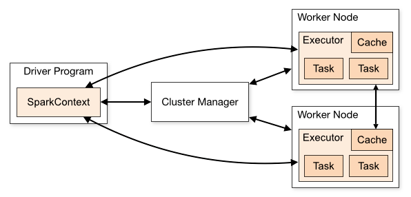
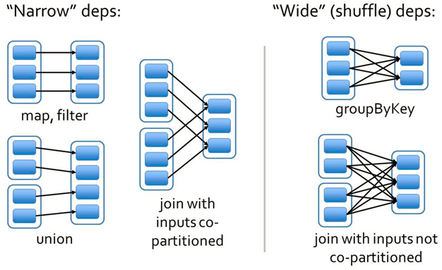

[toc]

# 一、Spark概述

> Apache Spark is a unified analytics engine for large-scale data processing. It provides high-level APIs in Java, Scala, Python and R, and an optimized engine that supports general execution graphs. It also supports a rich set of higher-level tools including  [Spark SQL](https://spark.apache.org/docs/latest/sql-programming-guide.html)  for SQL and structured data processing, [MLlib](https://spark.apache.org/docs/latest/ml-guide.html) for machine learning, [GraphX](https://spark.apache.org/docs/latest/graphx-programming-guide.html) for graph processing, and [Structured Streaming](https://spark.apache.org/docs/latest/structured-streaming-programming-guide.html) for incremental computation and stream processing.

Apache Spark是一个开源集群运算框架，是一种基于内存的快速、通用、可扩展的大数据分析计算引擎。与MR相比，Spark有***内存计算***和***优化自动化***的特点。

- 官网： https://spark.apache.org

- 官方文档： https://spark.apache.org/docs/latest/

- JIRA： https://issues.apache.org/jira/projects/SPARK/issues

- Github：https://github.com/apache/spark

- Databricks博客： https://databricks.com/blog

## 1.1 发展历史

- 2009年

    - 诞生于加州大学伯克利分校的AMP实验室

- 2010年

    - 通过BSD许可证正式对外开源

- 2012年

    - 10月15日，第一个正式版0.6.0发布（core）

- 2013年

    - 2月27日，0.7.0发布，增加一些关键特性，如Python API、Spark Streaming alpha版本（streaming）
    - 6月21日，捐赠给Apache软件基金会，协议切换至Apache 2.0，进入Apache孵化器
    - 9月，0.8版本（YARN）
    
- 2014年

    - 2月，成为Apache顶级项目
    - 2月2日，0.9.0发布，增加GraphX、机器学习&流式计算新特性（GraphX）
    - 5月30号，1.0.0发布（Spark SQL）

- 2015年

    - 3月13号，1.3.0发布，引入DataFrame API

- 2016年

    - 1月4号，1.6.0发布，引入DataSet API
    - 7月26号，2.0.0发布
    
- 2017年

    - 7月11号，2.2.0发布（Structured Streaming）

- 2018年

    - 2月28号，2.3.0发布

- 2019年

    - 4月，2.4.2发布
    - 9月1号，2.4.4发布

- 2020年

    - 6月5号，2.4.6发布
    - 6月18号，3.0.0发布
    - 9月8号，3.0.1发布
    - 9月12号，2.4.7发布

- 2021年

    - 3月，3.1.1发布

      

## 1.2 各版本支持

| 版本    | Java    | Scala | Python      | R    |
| ------- | ------- | ----- | ----------- | ---- |
| 1.0.2 + | 6+      | 2.10  | 2.6+        | -    |
| 1.4.0 + | 6+      | 2.10  | 2.6+        | 3.1+ |
| 1.5.0 + | 7+      | 2.10  | 2.6+        | 3.1+ |
| 2.2.0 + | 8+      | 2.11  | 2.7+ / 3.4+ | 3.1+ |
| 2.4.1 + | 8+      | 2.12  | 2.7+ / 3.4+ | 3.1+ |
| 3.0.0   | 8  / 11 | 2.12  | 2.7+ / 3.4+ | 3.1+ |
| 3.0.1 + | 8  / 11 | 2.12  | 2.7+ / 3.4+ | 3.5+ |
| 3.1.1   | 8  / 11 | 2.12  | 3.6+        | 3.5+ |

Spark支持的各相关版本：

- Spark 2.2.0：移除对Java 7、Python 2.6、Hadoop 2.5及更早版本的支持

-  Spark 2.3.0：移除对Scala 2.10的支持

- Spark 2.4.1：弃用对Scala 2.11的支持，将在Spark 3.0中删除

至少以下3个地方会涉及到Spark和Scala库的版本一致性，如果处理不好，在开发和运行时，会频频出错 [1][]：

1. Spark框架编译时使用的Scala版本；

2. Spark程序编译时的Scala版本；

3. Spark程序运行时的Scala版本。

解决上述问题的原则是：第2和第3所涉及的Scala版本，要和第1的Scala版本保持一致。开发环境中有Scala库、运行环境中有Scala库、Maven构建时也会有Scala库，Spark自身运行也带了Scala库，Spark框架的编译也用到了Scala库，要搞清楚在开发和运行的各个阶段用到了哪个Scala库。

## 1.3 资料

Spark的资料比较少，主要参考是**官网文档**和**DataBricks博客**。此外，书籍推荐有：

- [Spark内核设计的艺术](https://book.douban.com/subject/30157181/)

- [Spark SQL内核剖析](https://book.douban.com/subject/30296615/)

# 二、Spark组件

Spark包含很多子模块，按重要程度可分为核心功能（core）和扩展功能。核心功能是Spark设计理念的核心实现，是扩展功能的基础；在核心功能之上不断集成丰富的扩展功能，可使Spark满足更多用户需求，促进Spark生态繁荣发展。

## 2.1 Spark Core

Spark的核心功能实现，是一个大数据分布式编程框架。不仅实现了MR的map和reduce函数以及计算模型，还提供更丰富的算子，如flatMap、filter、join、groupByKey等。Core将分布式数据抽象为RDD，实现应用任务调度、RPC、序列化、压缩，并为上层组件提供API。Core底层使用Scala实现，提供的API深度借鉴Scala函数式编程思想，支持Scala、Java、Python、R语言。

Spark分布式数据集支持存储在Hadoop支持的文件系统之上（HDFS、Amazon S3、HBase、本地文件系统，等等）。

Spark集群资源管理器支持本地运行模式（Local）、独立运行模式（Standalone，Spark自带的资源管理器）、亚马逊弹性计算云EC2、Mesos、YARN。

主要包括：

- 基础设施
    - 包括`SparkConf`、内置RPC框架、事件总线（`ListenerBus`）、度量系统。
- `SparkContext`
    - 对开发者提供完成开发所需的API，屏蔽了网络通信、分布式补数、消息通信、存储体系、计算引擎、度量系统、文件服务、Web UI等内容。
- `SparkEnv`
    - Task运行所必须的组件，封装了`RpcEnv`、序列化管理器、广播管理器（`BroadcastManager`）、map任务输出跟踪器、存储体系、度量系统、输出提交协调器等组件。
- 存储体系
- 调度系统
    - 由`DAGScheduler`和`TaskScheduler`组成，内置在`SparkContext`中。
- 计算引擎
    - 由内存管理器、Tungsten、任务内存管理器、Task、外部排序器、Shuffle管理器等组成。

## 2.2 Spark SQL

SQL普及率高、学习成本低，Spark SQL提供大数据上的SQL处理能力，还为熟悉Hadoop的用户提供Hive SQL处理能力，类似于Hive在Hadoop生态系统中的角色。

Spark SQL使用Catalyst做查询解析和优化器，底层使用Spark作为执行引擎实现SQL的Operator。

## 2.3 Spark Streaming

通过将流数据按指定时间片积累为RDD，然后将每个RDD进行批处理，进而实现大规模的流式计算处理能力。支持Kafka、Twitter、MQTT、ZeroMQ、简单的TCP套接字等数据源。Dstream是Spark Streaming中所有数据流的抽象，本质上由一系列连续的RDD组成，可以被组织为Dstream Grpah。

## 2.4 GraphX

分布式图计算框架，遵循BSP（Bulk Synchronous Parallell，整体同步并行计算）模式下的Pregel模型实现，封装了最短路径、网页排名、连接组件、三角关系统计等算法的实现。

## 2.5 MLlib

机器学习框架，提供了基础统计、分类、回归、决策树、随机森林、朴素贝叶斯、保序回归等等多重数理统计、概率论、数据挖掘方面的数学算法。

# 三、Spark模型

## 3.1 编程模型

Spark应用程序编写、提交、执行、输出的过程如图：

1. 用户使用SparkContext提供的API编写driver应用程序（`SparkSession`、DataFrame、SQLContext、HiveContext、StreamingContext都对SparkContext进行了封装）。
2. 使用`SparkContext`提交用户应用程序：
    1. 通过`RpcEnv`向集群管理器（Cluster Manager）注册应用（Application），并告知集群管理器其需要的资源数量
    2. 集群管理器根据Application需求，给Application分配Executor资源，并在Worker上启动`CoarseGrainedExecutorBackend`进程，该进程内部将创建Executor
    3. Executor所在的`CoarseGrainedExecutorBackend`进程在启动的过程中通过`RpcEnv`直接向Driver注册Executor的资源信息，`TaskScheduler`将保存已经分配给应用的Executor资源的地址、大小等相关信息
    4. `SparkContext`根据各种转换API，构建RDD之间的血缘关系和DAG，RDD构成的DAG最终提交给`DAGScheduler`
    5. `DAGScheduler`给提交的DAG创建Job，并根据RDD的依赖性质将DAG划分为不同的Stage
    6. `DAGScheduler`根据Stage内RDD的Partition数量创建多个Task并批量提交给`TaskScheduler`
    7. `TaskScheduler`对批量的Task按照FIFO或者FAIR调度算法进行调度，然后给Task分配Executor资源，最后将Task发送给Executor执行
    8. 此外`SparkContext`还会在RDD转换开始之前使用`BlockManager`和`BroadcastManager`将任务的Hadoop配置进行广播。
3. 集群管理器根据应用需求分配资源，将具体任务分配到不同Worker节点上的多个Executor来执行。Standalone、YARN、Mesos、EC2都可以作为Spark的集群管理器。
4. Task在运行的过程中需要对一些数据（如中间结果、检查点）进行持久化，Spark支持HDFS、Amazon S3、Alluxio（原Tachyon）等作为存储。

## 3.2 RDD计算模型

RDD(弹性分布式数据集，Resilient Distributed Dataset)本质是一种分布式的内存抽象，表示一个只读的数据分区(Partition)的集合。Spark的计算过程主要是RDD的迭代计算过程，该过程非常类似于管道。RDD定义了各种丰富的转换操作，通过这些操作，新的RDD包含了如何从其他RDD衍生所必需的信息。

分区数量取决于Partition数量的设定，每个分区数据只会在一个Task中计算。所有分区可以在多个机器节点的Executor上并行执行。

DAGScheduler根据是否有`ShuffleDependency`将RDD划分为不同的Stage。`ShuffleDependency`指shuffle依赖，也称为宽依赖，即子RDD对父RDD中的所有Partition都有依赖（O(n)，与数据规模有关）；`NarrowDependency`也称窄依赖，即子RDD依赖于父RDD中固定的Partition（O(1)，与数据规模无关）。窄依赖分为OneToOneDependency和RangeDependency两种。窄依赖中的所有转换操作可以通过类似管道等方式全部执行，宽依赖意味着数据传输需要在不同节点之间Shuffle传输。

总而言之，基于RDD的计算任务可以描述为：

1. 从稳定的物理存储（如HDFS）中加载记录；
2. 记录被传入由一组确定性操作构成的DAG；
3. 然后写会稳定存储。

## 3.3 DataFrame和DataSet

Spark在RDD的基础上提供了`DataFrame`和`DataSet`用户编程接口，并在跨语言(Scala/Java/Python/R)方面有很好的支持。从Spark 2.0开始，`DataFrame`和`DataSet`进行了统一。

`DataFrame`和RDD一样，也是不可变分布式弹性数据集。RDD中数据不包含任何结构性信息，而`DataFrame`中的数据集类似于关系数据库中的表，按列名存储，每一列都带有名称和类型。`DataFrame`中的数据抽象是命名元组(`Row`类型)，可以理解为`DataFrame = RDD[Row] + schema`。

`DataSet`具有更强大的API，`DataFrame`与`DataSet`整合之后，`DataSet`具有两个完全不同的API特征：强类型API和弱类型API。强类型一般通过Scala中的Case Class或Java的Class来执行；弱类型即`DataFrame`，本质是一种特殊的`DataSet`（`DataSet[Row]`类型）。

`DataFrame`和`Datase`t实质上都是一个逻辑计划，并且是懒加载的，包含schema信息，只有到数据要读取的时候，才会将逻辑计划进行分析和优化，并最终转化为RDD。

# 四、 Spark基本架构

从集群部署视角，Spark集群有集群管理器（Cluster Manager）、Worker、Executor、Driver、Application等几个概念。

- Application
  - 用户使用Spark提供的API编写的应用程序。Application通过Spark API进行RDD的转换和DAG构建，并通过Driver将Application注册到Cluster Manager。Cluster Manager以及分配Executor、内存、CPU等资源，Driver二级分配将资源。
- Driver
  - Application的驱动程序，Application通过Driver与Cluster Manager、Executor进行通信。
- Cluster Manager
  - 集群管理器，负责整个集群资源的分配与管理。集群管理器的分配属于一级分配，它将各个Worker上的内存、CPU等资源分配给Applicaiton，但不负责对Executor的资源分配。Standalone、YARN、Mesos、EC2等都可以作为Spark的集群管理器。
- Worker
  - 工作节点。Worker负责创建Executor、将资源和任务进一步分配给Executor、同步资源信息给Cluster Manager。

| -               | YARN            | Standalone | Mesos       |
| --------------- | --------------- | ---------- | ----------- |
| Cluster Manager | ResourceManager | Master     | MesosMaster |
| Worker          | NodeManager     | Worker     |             |

​	

------

[1]:  http://www.bigdatastudy.net/show.aspx?id=644&cid=9