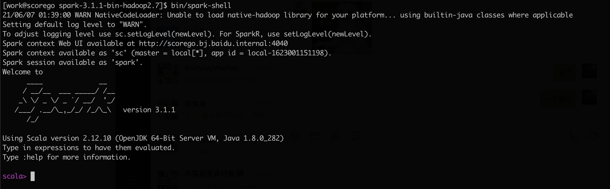
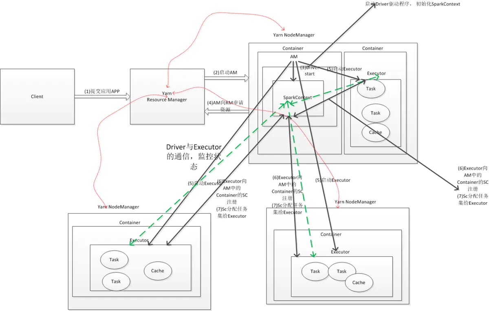
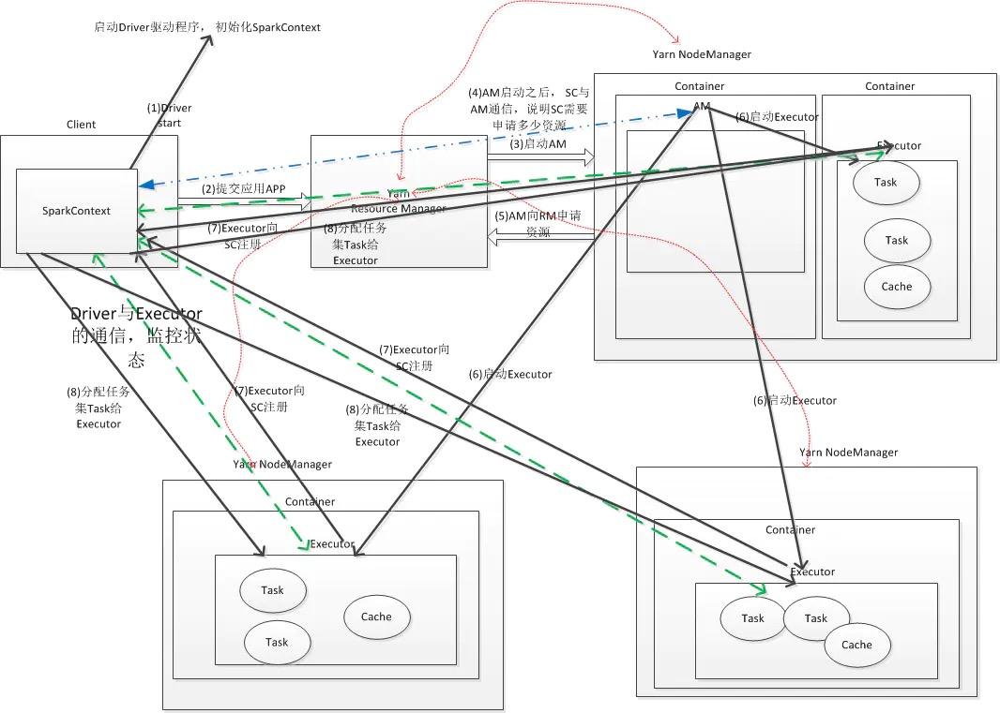

> Spark有很多种运行模式，如Local、Standalone、YARN等。Spark在不同的部署模式下的区别是实现`TaskScheduler` 和`SchedulerBackend`。Spark会在`SparkContext`的创建过程中通过传入的Master URL来确定不同的运行模式，并且创建不同的`TaskScheduler`和`SchedulerBackend`，具体实现是在`org.apache.spark.SparkContext#createTaskScheduler`中：
>
> ```scala
> //  Standalone模式： spark://
> //  YARN模式：  yarn：
> //  Mesos模式： (mesos|zk)://
> master match {
>       case "local" =>
>         checkResourcesPerTask(1)
>         val scheduler = new TaskSchedulerImpl(sc, MAX_LOCAL_TASK_FAILURES, isLocal = true)
>         val backend = new LocalSchedulerBackend(sc.getConf, scheduler, 1)
>         scheduler.initialize(backend)
>         (backend, scheduler)
> 
>       case LOCAL_N_REGEX(threads) =>
>         def localCpuCount: Int = Runtime.getRuntime.availableProcessors()
>         // local[*] estimates the number of cores on the machine; local[N] uses exactly N threads.
>         val threadCount = if (threads == "*") localCpuCount else threads.toInt
>         if (threadCount <= 0) {
>           throw new SparkException(s"Asked to run locally with $threadCount threads")
>         }
>         checkResourcesPerTask(threadCount)
>         val scheduler = new TaskSchedulerImpl(sc, MAX_LOCAL_TASK_FAILURES, isLocal = true)
>         val backend = new LocalSchedulerBackend(sc.getConf, scheduler, threadCount)
>         scheduler.initialize(backend)
>         (backend, scheduler)
> 
>       case LOCAL_N_FAILURES_REGEX(threads, maxFailures) =>
>         def localCpuCount: Int = Runtime.getRuntime.availableProcessors()
>         val threadCount = if (threads == "*") localCpuCount else threads.toInt
>         checkResourcesPerTask(threadCount)
>         val scheduler = new TaskSchedulerImpl(sc, maxFailures.toInt, isLocal = true)
>         val backend = new LocalSchedulerBackend(sc.getConf, scheduler, threadCount)
>         scheduler.initialize(backend)
>         (backend, scheduler)
> 
>       case SPARK_REGEX(sparkUrl) =>
>         val scheduler = new TaskSchedulerImpl(sc)
>         val masterUrls = sparkUrl.split(",").map("spark://" + _)
>         val backend = new StandaloneSchedulerBackend(scheduler, sc, masterUrls)
>         scheduler.initialize(backend)
>         (backend, scheduler)
> 
>       case LOCAL_CLUSTER_REGEX(numWorkers, coresPerWorker, memoryPerWorker) =>
>         checkResourcesPerTask(coresPerWorker.toInt)
>         val memoryPerWorkerInt = memoryPerWorker.toInt
>         if (sc.executorMemory > memoryPerWorkerInt) {
>           throw new SparkException(
>             "Asked to launch cluster with %d MiB RAM / worker but requested %d MiB/worker".format(
>               memoryPerWorkerInt, sc.executorMemory))
>         }
> 
>         sc.conf.setIfMissing(SHUFFLE_HOST_LOCAL_DISK_READING_ENABLED, false)
> 
>         val scheduler = new TaskSchedulerImpl(sc)
>         val localCluster = new LocalSparkCluster(
>           numWorkers.toInt, coresPerWorker.toInt, memoryPerWorkerInt, sc.conf)
>         val masterUrls = localCluster.start()
>         val backend = new StandaloneSchedulerBackend(scheduler, sc, masterUrls)
>         scheduler.initialize(backend)
>         backend.shutdownCallback = (backend: StandaloneSchedulerBackend) => {
>           localCluster.stop()
>         }
>         (backend, scheduler)
> 
>       case masterUrl =>
>         val cm = getClusterManager(masterUrl) match {
>           case Some(clusterMgr) => clusterMgr
>           case None => throw new SparkException("Could not parse Master URL: '" + master + "'")
>         }
>         try {
>           val scheduler = cm.createTaskScheduler(sc, masterUrl)
>           val backend = cm.createSchedulerBackend(sc, masterUrl, scheduler)
>           cm.initialize(scheduler, backend)
>           (backend, scheduler)
>         } catch {
>           case se: SparkException => throw se
>           case NonFatal(e) => throw new SparkException("External scheduler cannot be instantiated", e)
>         }
>     }
> ```

# 一、 Local模式

## 1. 准备工作：

- JDK：可使用`java -version`查看java版本。
- scala环境：只需要开发环境有就行，部署环境并不是必需。
- Spark安装包：可在官网获取。

## 2. 原理

在本地使用多线程模拟分布式运行，每个线程代表一个worker。

Local部署模式的不同之处在于任务失败后的重试次数。

| Master-URL                                              | 备注                                                | Meaning                                                      | Max-Retry time               |
| :------------------------------------------------------ | --------------------------------------------------- | :----------------------------------------------------------- | :--------------------------- |
| local                                                   | 所有进程都运行在一台机器的JVM中                     | 1 worker Thread(no parallelism)                              | 失败的任务不会重新尝试       |
| local[N]                                                |                                                     | N  worker Threads,ideally set to cores number                | 失败的任务不会重新尝试       |
| local[*]                                                |                                                     | as many worker Threads as your machine                       | 失败的任务不会重新尝试       |
| local[N,F]                                              |                                                     | N worker Threads                                             | 失败的任务最多进行F-1次尝试  |
| local[*,F]                                              |                                                     | as many worker Threads as your machine                       | 失败的任务最多进行F-1此尝试  |
| local-cluster[numSlaves,coresPerSlave,memeoryPerySlave] | 在一台机器中模拟集群运行,相关的进程在同一台机器上。 | 伪分布式模式，本地运行master和worker，master中指定了worker数目，CPU core数目和每个worker能使用的内存 | 其他与standalone运行模式相同 |

## 3. 操作

可以先看下Spark安装包的目录结构：

```shell
[work@scorego spark-3.1.1-bin-hadoop2.7]$ pwd
/home/work/deploy/spark-3.1.1-bin-hadoop2.7
[work@scorego spark-3.1.1-bin-hadoop2.7]$ ll
总用量 156
drwxr-xr-x 2 work work  4096 6月   7 01:35 bin							脚本
drwxr-xr-x 2 work work  4096 6月   7 01:35 conf						配置文件
drwxr-xr-x 5 work work  4096 6月   7 01:35 data
drwxr-xr-x 4 work work  4096 6月   7 01:35 examples
drwxr-xr-x 2 work work 20480 6月   7 01:35 jars						jar包
drwxr-xr-x 4 work work  4096 6月   7 01:35 kubernetes
-rw-r--r-- 1 work work 23235 6月   7 01:35 LICENSE
drwxr-xr-x 2 work work  4096 6月   7 01:35 licenses
-rw-r--r-- 1 work work 57677 6月   7 01:35 NOTICE
drwxr-xr-x 7 work work  4096 6月   7 01:35 python
drwxr-xr-x 3 work work  4096 6月   7 01:35 R
-rw-r--r-- 1 work work  4488 6月   7 01:35 README.md
-rw-r--r-- 1 work work   183 6月   7 01:35 RELEASE
drwxr-xr-x 2 work work  4096 6月   7 01:35 sbin						脚本
drwxr-xr-x 2 work work  4096 6月   7 01:35 yarn
```

其实这时就已经可以使用local模式了。如果想不受目录限制随时使用相关命令，则可以把spark根目录添加到环境变量中：

```shell
vim /etc/profile
 
# 在文件末尾添加如下内容：
 
# SPARK_HOME
export SPARK_HOME=/home/work/deploy/spark-3.1.1-bin-hadoop2.7
export PATH=$PATH:$SPARK_HOME/bin
 
export JAVA_HOME=/usr/lib/jvm/java-1.8.0-openjdk-1.8.0.282.b08-1.el7_9.x86_64
export PATH=$PATH:$JAVA_HOME/bin
export CLASSPATH=.:$JAVA_HOME/lib/dt.jar:$JAVA_HOME/lib/tools.jar

export SCALA_HOME=/home/work/tools/scala-2.12.13
export PATH=$PATH:$SCALA_HOME/bin
```

## 4. 测试

运行spark-shell:



可以根据提示查看Web UI，地址为：http://180.76.156.161:4040/ (ip是云主机的地址。)


# 二、 Standalone 独立集群模式

## 1. 准备工作

## 2. 操作

### a. 集群规划

```
node1: master
node2: slave/worker
node3: slave/worker
```

### b. 配置worker

进入配置目录，修改`worker`配置文件（低版本中该配置文件名是`slaves`）：

```
cp workers.template worker
```

该配置文件的初始内容为：

```shell
# A Spark Worker will be started on each of the machines listed below.
localhost
```

修改为：

```bash
node1
node2
```

### c. 配置master

进入配置目录，修改`spark-env.sh`：

```shell
cp spark-env.sh.template spark-env.sh
```

添加内容：	

```
# 指定master的IP和端口
SPARK_MASTER_HOST=node1
SPARK_MASTER_PORT=7077

SPARK_MASTER_WEBUI_PORT=8080

# HADOOP配置文件目录
HADOOP_CONG_DIR=/home/work/deploy/hadoop2.7/conf
YARN_CONF_DIR=/home/work/deploy/hadoop2.7/conf

JAVA_HOME=/usr/lib/jvm/java-1.8.0-openjdk-1.8.0.282.b08-1.el7_9.x86_64
```

### d. 分发

把该Spark目录从master机器分发到另外的worker机器上。或者worker机器安装同版本Spark包，并修改配置文件也可。

```shell
# 用rsync之类的工具也可
cd /home/work/deploy
scp -r /home/work/deploy/spark-3.1.1-bin-hadoop2.7 worker@node2:$PWD
scp -r /home/work/deploy/spark-3.1.1-bin-hadoop2.7 worker@node3:$PWD
```


### 3. 集群的启动和停止

相关脚本在`sbin`目录：

```shell
[work@scorego spark-3.1.1-bin-hadoop2.7]$ ll sbin/
总用量 112
-rwxr-xr-x 1 work work  981 6月   7 01:35 decommission-slave.sh
-rwxr-xr-x 1 work work 2028 6月   7 01:35 decommission-worker.sh
-rwxr-xr-x 1 work work  957 6月   7 01:35 slaves.sh
-rwxr-xr-x 1 work work 1429 6月   7 01:35 spark-config.sh
-rwxr-xr-x 1 work work 6333 6月   7 01:35 spark-daemon.sh
-rwxr-xr-x 1 work work 1264 6月   7 01:35 spark-daemons.sh
-rwxr-xr-x 1 work work 1192 6月   7 01:35 start-all.sh
-rwxr-xr-x 1 work work 1764 6月   7 01:35 start-history-server.sh
-rwxr-xr-x 1 work work 2097 6月   7 01:35 start-master.sh
-rwxr-xr-x 1 work work 1877 6月   7 01:35 start-mesos-dispatcher.sh
-rwxr-xr-x 1 work work 1425 6月   7 01:35 start-mesos-shuffle-service.sh
-rwxr-xr-x 1 work work  967 6月   7 01:35 start-slave.sh					# deprecated, use start-worker.sh
-rwxr-xr-x 1 work work  969 6月   7 01:35 start-slaves.sh				# deprecated, use start-workers.sh
-rwxr-xr-x 1 work work 2025 6月   7 01:35 start-thriftserver.sh
-rwxr-xr-x 1 work work 3245 6月   7 01:35 start-worker.sh
-rwxr-xr-x 1 work work 1560 6月   7 01:35 start-workers.sh
-rwxr-xr-x 1 work work 1481 6月   7 01:35 stop-all.sh
-rwxr-xr-x 1 work work 1056 6月   7 01:35 stop-history-server.sh
-rwxr-xr-x 1 work work 1080 6月   7 01:35 stop-master.sh
-rwxr-xr-x 1 work work 1227 6月   7 01:35 stop-mesos-dispatcher.sh
-rwxr-xr-x 1 work work 1084 6月   7 01:35 stop-mesos-shuffle-service.sh
-rwxr-xr-x 1 work work  965 6月   7 01:35 stop-slave.sh				# deprecated, use stop-worker.sh
-rwxr-xr-x 1 work work  967 6月   7 01:35 stop-slaves.sh				# deprecated, use stop-workers.sh
-rwxr-xr-x 1 work work 1066 6月   7 01:35 stop-thriftserver.sh
-rwxr-xr-x 1 work work 1569 6月   7 01:35 stop-worker.sh
-rwxr-xr-x 1 work work 1066 6月   7 01:35 stop-workers.sh
-rwxr-xr-x 1 work work 3399 6月   7 01:35 workers.sh
```

- 启停集群

  在主节点：

  ```
  start-all.sh
  stop-all.sh
  ```

- 单独启停

  在主节点单独启动和停止master：

  ```
  start-master.sh
  stop-master.sh
  ```

  在从节点单独启动和停止worker:

  ```
  start-worker.sh
  stop-worker.sh
  ```

观察：

- `jps`

- master： http://node1:8080

- worker:  http://node2:8081

### 4. 测试

启动`spark-shell`：

```
bin/spark-shell --master spark://node1:7077
```

Web UI: http://node1:4040


默认端口总结:

- spark
  - 4040：任务运行web ui界面端口
  - 8080：spark集群web ui界面端口
  - 7077：提交任务时的通信端口
- hadoop
  - 50070：集群web ui界面端口
  - 8020/9000(老版本)：文件上传下载通信端口


# 三、Spark On YARN

## 1. 原理

Spark On YARN的本质是把Spark任务的字节码文件打成jar包，上传到YARN集群的JVM中运行。同时Spark集群的相关角色也会在YARN的JVM中运行。

YARN是集群的资源管理系统，有几个概念：

- `ResourceManager`：负责整个集群的资源管理和分配。
- `NodeManager`：每个节点的资源和任务管理器，负责启动/停止Container，并监视资源使用情况。可以理解为集群的每一台slave。
- `ApplicationMaster`：YARN中每个Application对应一个AM进程，负责向RM申请资源，获取资源后告诉`NodeManager`为其分配并启动`Container`。(资源其实就是`Container`，`Container`可以理解为cpu cores、memory)

- `Container`：YARN中的抽象资源。

## 2. 运行模式

Spark On YARN由两种运行模式：

- client

  在yarn上启动一个appmaster作为Driver，完成`DAGscheduler`和`TaskScheduler`，安装Spark的机器是“仅上传jar包到HDFS的角色”。

- cluster

  Driver程序在YARN中运行。

### a. cluster模式

```shell
 ./bin/spark-submit --class org.apache.spark.examples.SparkPi \
    --master yarn \
    --deploy-mode cluster \
    --driver-memory 1g \
    --executor-memory 1g \
    --executor-cores 2 \
    --queue default \
    lib/spark-examples*.jar \
    10
```



Spark Driver首先作为一个`ApplicationMaster`在YARN集群中启动，客户端提交给`ResourceManager`的每一个job都会在集群的`NodeManager`节点上分配一个唯一的`ApplicationMaster`，由该`ApplicationMaster`管理全生命周期的应用。具体过程：

1. 由client向`ResourceManager`提交请求，并上传jar到HDFS上。这期间包括四个步骤：
   - 连接到RM 
   - 从RM的ASM（ApplicationsManager ）中获得metric、queue和resource等信息。 
   - upload app jar and spark-assembly jar 
   - 设置运行环境和container上下文（launch-container.sh等脚本)
2. `ResouceManager`向`NodeManager`申请资源，创建 `ApplicationMaster`（每个`SparkContext`都有一个`ApplicationMaster`）
3. `NodeManager`启动`ApplicationMaster`，并向`ResourceManager ASM` 注册
4. `ApplicationMaster`从HDFS中找到jar文件，启动`SparkContext`、`DAGscheduler`和YARN Cluster Scheduler
5. `ResourceManager`向`ResourceManager ASM`注册申请container资源
6. `ResourceManager`通知`NodeManager`分配container，这时可以收到来自ASM关于container的报告。（每个container对应一个executor）
7. Spark `ApplicationMaster`直接和container（executor）进行交互，完成这个分布式任务。

### b. client模式

```shell
./bin/spark-submit --class org.apache.spark.examples.SparkPi \
    --master yarn \
    --deploy-mode client \
    --driver-memory 1g \
    --executor-memory 1g \
    --executor-cores 2 \
    --queue default \
    lib/spark-examples*.jar \
    10
```

在client模式下，Driver运行在Client上，通过`ApplicationMaster`向RM获取资源。本地Driver负责与所有的executor container进行交互，并将最后的结果汇总。



客户端的Driver将应用提交给Yarn后，Yarn会先后启动`ApplicationMaster`和executor，另外`ApplicationMaster`和executor都是装载在container里运行，container默认的内存是1G，`ApplicationMaster`分配的内存是driver-memory，executor分配的内存是executor-memory。Driver以进程名为`SparkSubmit`的形式存在。

