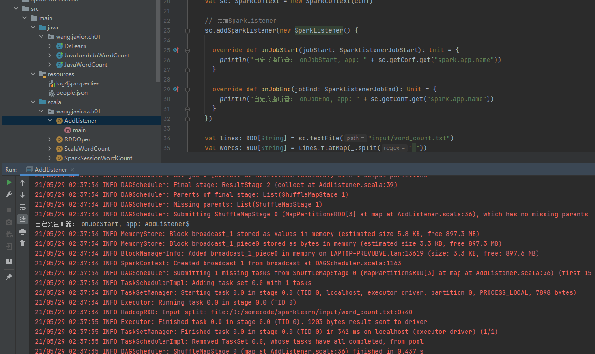
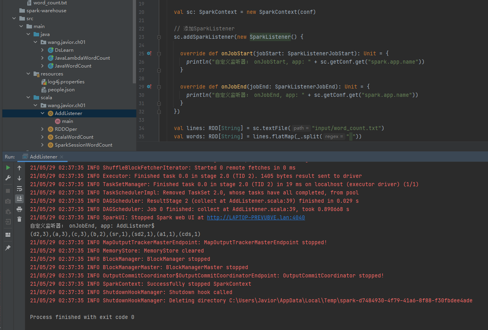
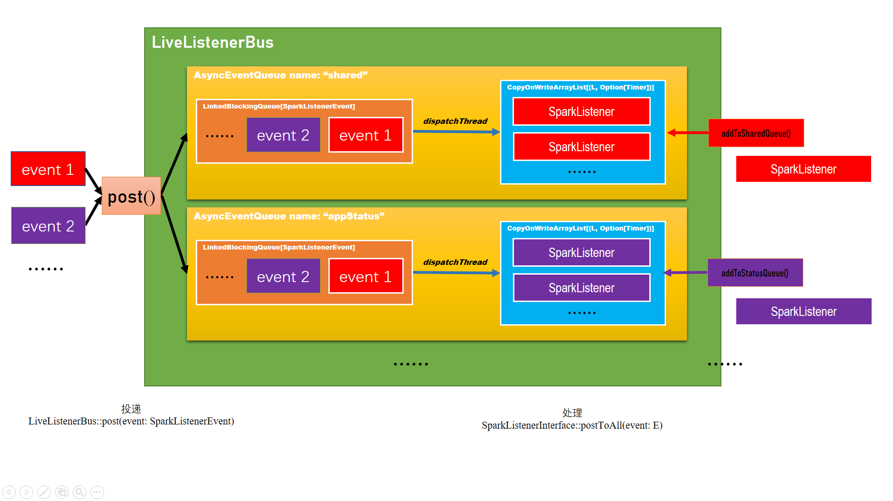

> `ListenerBus[L <: AnyRef, E]`特质是事件总线的意思，事件总线可以接受事件并将事件提交给对应的监听器，我们经常看到基于事件的监控、数据采集等。Spark Core内部的事件框架实现了基于事件的异步化编程模式，它的最大好处是可以提升应用程序对物理资源的充分利用，能最大限度的压榨物理资源，提升应用程序的处理效率；缺点比较明显，降低了应用程序的可读性。Spark的基于事件的异步化编程框架由事件框架和异步执行线程池组成，应用程序产生的Event发送给`ListenerBus`，`ListenerBus`再把消息广播给所有的Listener，每个Listener收到Event后判断是否自己感兴趣的Event，若是，会在Listener独享的线程池中执行Event所对应的逻辑程序块。

# 一、 `ListenerBus`

`ListenerBus[L <: AnyRef, E]`是个泛型特质，泛型参数为`[L <: AnyRef, E]`，其中`L`是代表监听器，`E`代表事件。

```scala
package org.apache.spark.util

/**
 * An event bus which posts events to its listeners.
 */
private[spark] trait ListenerBus[L <: AnyRef, E] extends Logging {

    // 维护所有注册的监听器，Timer是com.codahale.metrics.Timer类
    private[this] val listenersPlusTimers = new CopyOnWriteArrayList[(L, Option[Timer])]

    private lazy val env = SparkEnv.get

    private lazy val logSlowEventEnabled = if (env != null) {
            // "spark.scheduler.listenerbus.logSlowEvent"
            env.conf.get(config.LISTENER_BUS_LOG_SLOW_EVENT_ENABLED)
        } else {
            false
        }

    private lazy val logSlowEventThreshold = if (env != null) {
            // "spark.scheduler.listenerbus.logSlowEvent.threshold"
            env.conf.get(config.LISTENER_BUS_LOG_SLOW_EVENT_TIME_THRESHOLD)
        } else {
            Long.MaxValue
        }

    final def addListener(listener: L): Unit = { listenersPlusTimers.add((listener, getTimer(listener)))}

    final def removeListener(listener: L): Unit = {
        listenersPlusTimers.asScala.find(_._1 eq listener)
        	.foreach { listenerAndTimer => listenersPlusTimers.remove(listenerAndTimer) }
    }
    
    final def removeAllListeners(): Unit = { listenersPlusTimers.clear() }

    protected def doPostEvent(listener: L, event: E): Unit

    def postToAll(event: E): Unit = {
        // JavaConverters can create a JIterableWrapper if we use asScala.
        // However, this method will be called frequently. To avoid the wrapper cost, here we use Java Iterator directly.
        val iter = listenersPlusTimers.iterator
        while (iter.hasNext) {
            val listenerAndMaybeTimer = iter.next()
            val listener = listenerAndMaybeTimer._1
            val maybeTimer = listenerAndMaybeTimer._2
            val maybeTimerContext = if (maybeTimer.isDefined) { maybeTimer.get.time() } else { null }
            lazy val listenerName = Utils.getFormattedClassName(listener)
            try {
                doPostEvent(listener, event)
                if (Thread.interrupted()) {
                    // We want to throw the InterruptedException right away so we can associate the interrupt
                    // with this listener, as opposed to waiting for a queue.take() etc. to detect it.
                    throw new InterruptedException()
                }
            } catch {
                case ie: InterruptedException =>
                    logError(s"Interrupted while posting to ${listenerName}. Removing that listener.", ie)
                    removeListenerOnError(listener)
                case NonFatal(e) if !isIgnorableException(e) =>
                		logError(s"Listener ${listenerName} threw an exception", e)
            } finally {
                if (maybeTimerContext != null) {
                    val elapsed = maybeTimerContext.stop()
                    if (logSlowEventEnabled && elapsed > logSlowEventThreshold) {
                        logInfo(s"Process of event ${redactEvent(event)} by listener ${listenerName} took " +
                                s"${elapsed / 1000000000d}s.")
                    }
                }
            }
        }
    }

    ...
}
```

继承体系：

```scala
private[spark] trait ListenerBus[L <: AnyRef, E] extends Logging

	private[sql] class ExecutionListenerBus => ListenerBus[QueryExecutionListener, SparkListenerSQLExecutionEnd]

	class ExternalCatalogWithListener => ListenerBus[ExternalCatalogEventListener, ExternalCatalogEvent]

	class ExternalCatalogWithListener => ListenerBus[ExternalCatalogEventListener, ExternalCatalogEvent]

	private[spark] trait SparkListenerBus => ListenerBus[SparkListenerInterface, SparkListenerEvent]

		private class AsyncEventQueue => SparkListenerBus

		private[spark] class ReplayListenerBus => SparkListenerBus

        private[streaming] class StreamingListenerBus => ListenerBus[StreamingListener, StreamingListenerEvent]

	class StreamingQueryListenerBus => ListenerBus[StreamingQueryListener, StreamingQueryListener.Event]
```

`SparkListenerBus`用于将`SparkListenerEvent`类型的事件投递到`SparkListenerInterface`类型的监听器，它有如下两种实现：

- `AsyncEventQueue`

  An asynchronous queue for events. All events posted to this queue will be delivered to the child listeners in a separate thread.

- `ReplayListenerBus` 

  A SparkListenerBus that can be used to replay events from serialized event data.

# 二、 `SparkListenerBus`

```scala
package org.apache.spark.scheduler

/**
 * A [[SparkListenerEvent]] bus that relays [[SparkListenerEvent]]s to its listeners
 */
private[spark] trait SparkListenerBus extends ListenerBus[SparkListenerInterface, SparkListenerEvent] {

  protected override def doPostEvent(listener: SparkListenerInterface, event: SparkListenerEvent): Unit = {
    event match {
      case stageSubmitted: SparkListenerStageSubmitted => listener.onStageSubmitted(stageSubmitted)
      case stageCompleted: SparkListenerStageCompleted => listener.onStageCompleted(stageCompleted)
      case jobStart: SparkListenerJobStart => listener.onJobStart(jobStart)
      case jobEnd: SparkListenerJobEnd => listener.onJobEnd(jobEnd)
      case taskStart: SparkListenerTaskStart => listener.onTaskStart(taskStart)
      case taskGettingResult: SparkListenerTaskGettingResult => listener.onTaskGettingResult(taskGettingResult)
      case taskEnd: SparkListenerTaskEnd => listener.onTaskEnd(taskEnd)
      case environmentUpdate: SparkListenerEnvironmentUpdate => listener.onEnvironmentUpdate(environmentUpdate)
      case blockManagerAdded: SparkListenerBlockManagerAdded => listener.onBlockManagerAdded(blockManagerAdded)
      case blockManagerRemoved: SparkListenerBlockManagerRemoved => listener.onBlockManagerRemoved(blockManagerRemoved)
      case unpersistRDD: SparkListenerUnpersistRDD => listener.onUnpersistRDD(unpersistRDD)
      case applicationStart: SparkListenerApplicationStart => listener.onApplicationStart(applicationStart)
      case applicationEnd: SparkListenerApplicationEnd => listener.onApplicationEnd(applicationEnd)
      case metricsUpdate: SparkListenerExecutorMetricsUpdate => listener.onExecutorMetricsUpdate(metricsUpdate)
      case stageExecutorMetrics: SparkListenerStageExecutorMetrics => listener.onStageExecutorMetrics(stageExecutorMetrics)
      case executorAdded: SparkListenerExecutorAdded => listener.onExecutorAdded(executorAdded)
      case executorRemoved: SparkListenerExecutorRemoved => listener.onExecutorRemoved(executorRemoved)
      case executorBlacklistedForStage: SparkListenerExecutorBlacklistedForStage =>
        listener.onExecutorBlacklistedForStage(executorBlacklistedForStage)
      case nodeBlacklistedForStage: SparkListenerNodeBlacklistedForStage =>
        listener.onNodeBlacklistedForStage(nodeBlacklistedForStage)
      case executorBlacklisted: SparkListenerExecutorBlacklisted => listener.onExecutorBlacklisted(executorBlacklisted)
      case executorUnblacklisted: SparkListenerExecutorUnblacklisted => listener.onExecutorUnblacklisted(executorUnblacklisted)
      case nodeBlacklisted: SparkListenerNodeBlacklisted => listener.onNodeBlacklisted(nodeBlacklisted)
      case nodeUnblacklisted: SparkListenerNodeUnblacklisted => listener.onNodeUnblacklisted(nodeUnblacklisted)
      case executorExcludedForStage: SparkListenerExecutorExcludedForStage =>
        listener.onExecutorExcludedForStage(executorExcludedForStage)
      case nodeExcludedForStage: SparkListenerNodeExcludedForStage => listener.onNodeExcludedForStage(nodeExcludedForStage)
      case executorExcluded: SparkListenerExecutorExcluded => listener.onExecutorExcluded(executorExcluded)
      case executorUnexcluded: SparkListenerExecutorUnexcluded => listener.onExecutorUnexcluded(executorUnexcluded)
      case nodeExcluded: SparkListenerNodeExcluded => listener.onNodeExcluded(nodeExcluded)
      case nodeUnexcluded: SparkListenerNodeUnexcluded => listener.onNodeUnexcluded(nodeUnexcluded)
      case blockUpdated: SparkListenerBlockUpdated => listener.onBlockUpdated(blockUpdated)
      case speculativeTaskSubmitted: SparkListenerSpeculativeTaskSubmitted =>
        listener.onSpeculativeTaskSubmitted(speculativeTaskSubmitted)
      case unschedulableTaskSetAdded: SparkListenerUnschedulableTaskSetAdded =>
        listener.onUnschedulableTaskSetAdded(unschedulableTaskSetAdded)
      case unschedulableTaskSetRemoved: SparkListenerUnschedulableTaskSetRemoved =>
        	listener.onUnschedulableTaskSetRemoved(unschedulableTaskSetRemoved)
      case resourceProfileAdded: SparkListenerResourceProfileAdded => listener.onResourceProfileAdded(resourceProfileAdded)
      case _ => listener.onOtherEvent(event)
	}
  }

}
```

从代码来看，`SparkListenerBus`特质就是实现了`doPostEvent()`方法，通过对`SparkListenerEvent`事件进行匹配，执行`SparkListenerInterface`监听器的相应方法。

当有事件需要通知监听器的时候，可以调用`SparkListenerBus`的`postToAll()`方法(`ListenerBus`特质已经实现了该方法)，该方法遍历所有监听器并调用`SparkListenerBus`实现的`doPostEvent()`方法。`doPostEvent()`方法对事件类型进行匹配后调用监听器的不同方法，整个投递事件是一个同步调用。在监听器比较多的时候，整个过程会比较耗时。`AsyncEventQueue`是一个异步投递消息的实现。

## 1. `AsyncEventQueue`

事件异步传播队列的实现类，采用了生产者—消费者模式。在`start()`方法被调用后Event才可以被分发到对应的Listener。

```scala
package org.apache.spark.scheduler

/**
 * An asynchronous queue for events. All events posted to this queue will be delivered to the child
 * listeners in a separate thread.
 *
 * Delivery will only begin when the `start()` method is called. The `stop()` method should be
 * called when no more events need to be delivered.
 */
private class AsyncEventQueue(
        val name: String,
        conf: SparkConf,
        metrics: LiveListenerBusMetrics,
        bus: LiveListenerBus) extends SparkListenerBus with Logging {
    
    // 存放事件的队列，具体是个LinkedBlockingQueue
		private val eventQueue = new LinkedBlockingQueue[SparkListenerEvent](capacity)
     
    // 事件传播异步化线程，即每个AsyncEventQueue实例有一个专门的线程来分发事件
    private val dispatchThread = new Thread(s"spark-listener-group-$name") {
        setDaemon(true)
        override def run(): Unit = Utils.tryOrStopSparkContext(sc) {
          dispatch()
        }
  	}
    
    // 不停的从eventQueue中取事件，并投递到所有监听器去。
  	//  监听器根据事件类型调用相匹配的方法，不同监听器只要实现不同的方法即可对不同事件做相应的操作。
    private def dispatch(): Unit = LiveListenerBus.withinListenerThread.withValue(true) {
        var next: SparkListenerEvent = eventQueue.take()
        while (next != POISON_PILL) {
          val ctx = processingTime.time()
          try {
            super.postToAll(next)
          } finally {
            ctx.stop()
          }
          eventCount.decrementAndGet()
          next = eventQueue.take()
        }
        eventCount.decrementAndGet()
  	}
    
    // 投递事件(就是将事件添加到eventQueue这个队列中)
    def post(event: SparkListenerEvent): Unit = {
        if (stopped.get()) {
          return
        }
		
        // 如果事件成功添加到队列里就返回
        eventCount.incrementAndGet()
        if (eventQueue.offer(event)) {
          return
        }
		
        // 事件添加失败(比如队列满了)，就drop event
        eventCount.decrementAndGet()
        droppedEvents.inc()
        droppedEventsCounter.incrementAndGet()
        if (logDroppedEvent.compareAndSet(false, true)) {
          // Only log the following message once to avoid duplicated annoying logs.
          logError(s"Dropping event from queue $name. " +
            "This likely means one of the listeners is too slow and cannot keep up with " +
            "the rate at which tasks are being started by the scheduler.")
        }
        logTrace(s"Dropping event $event")

        val droppedEventsCount = droppedEventsCounter.get
        val droppedCountIncreased = droppedEventsCount - lastDroppedEventsCounter
        val lastReportTime = lastReportTimestamp.get
        val curTime = System.currentTimeMillis()
        // Don't log too frequently
        if (droppedCountIncreased > 0 && curTime - lastReportTime >= LOGGING_INTERVAL) {
            // There may be multiple threads trying to logging dropped events,
            // Use 'compareAndSet' to make sure only one thread can win.
            if (lastReportTimestamp.compareAndSet(lastReportTime, curTime)) {
                val previous = new java.util.Date(lastReportTime)
                lastDroppedEventsCounter = droppedEventsCount
                logWarning(s"Dropped $droppedCountIncreased events from $name since " +
                  		   s"${if (lastReportTime == 0) "the application started" else s"$previous"}.")
          }
        }
  	}
    
    ...
}
  
private object AsyncEventQueue {

  val POISON_PILL = new SparkListenerEvent() { }

  val LOGGING_INTERVAL = 60 * 1000
}
```


## 2. `SparkListenerInterface`

`SparkListenerInterface`是spark core的监听器特质，不过基本上监听器实现都是继承`SparkListener`或`SparkFirehoseListener`。`SparkListenerInterface`下各个事件对应的方法名非常直白，即如字面所表达意思。想对哪个阶段的事件做一些自定义的动作，实现对应的方法即可。

```scala
/**
 * Interface for listening to events from the Spark scheduler. Most applications should probably
 * extend SparkListener or SparkFirehoseListener directly, rather than implementing this class.
 *
 * Note that this is an internal interface which might change in different Spark releases.
 */
private[spark] trait SparkListenerInterface {
	
    // stage完成时触发的事件
		def onStageCompleted(stageCompleted: SparkListenerStageCompleted): Unit
	
    // stage提交时触发的事件
    def onStageSubmitted(stageSubmitted: SparkListenerStageSubmitted): Unit
	
    // task开始时触发的事件
    def onTaskStart(taskStart: SparkListenerTaskStart): Unit
    
    // task开始原生fetch结果时触发的事件(will not be called for tasks that do not need to fetch the result remotely)
    def onTaskGettingResult(taskGettingResult: SparkListenerTaskGettingResult): Unit
    
    def onTaskEnd(taskEnd: SparkListenerTaskEnd): Unit
    def onJobStart(jobStart: SparkListenerJobStart): Unit
    def onJobEnd(jobEnd: SparkListenerJobEnd): Unit
    def onEnvironmentUpdate(environmentUpdate: SparkListenerEnvironmentUpdate): Unit
		def onBlockManagerAdded(blockManagerAdded: SparkListenerBlockManagerAdded): Unit
    def onBlockManagerRemoved(blockManagerRemoved: SparkListenerBlockManagerRemoved): Unit
		def onUnpersistRDD(unpersistRDD: SparkListenerUnpersistRDD): Unit
    def onApplicationStart(applicationStart: SparkListenerApplicationStart): Unit
    def onApplicationEnd(applicationEnd: SparkListenerApplicationEnd): Unit
		def onExecutorMetricsUpdate(executorMetricsUpdate: SparkListenerExecutorMetricsUpdate): Unit
    def onStageExecutorMetrics(executorMetrics: SparkListenerStageExecutorMetrics): Unit
    def onExecutorAdded(executorAdded: SparkListenerExecutorAdded): Unit
    def onExecutorRemoved(executorRemoved: SparkListenerExecutorRemoved): Unit
    
    @deprecated("use onExecutorExcluded instead", "3.1.0")
  	def onExecutorBlacklisted(executorBlacklisted: SparkListenerExecutorBlacklisted): Unit
    def onExecutorExcluded(executorExcluded: SparkListenerExecutorExcluded): Unit
    
    @deprecated("use onExecutorExcludedForStage instead", "3.1.0")
  	def onExecutorBlacklistedForStage(executorBlacklistedForStage: SparkListenerExecutorBlacklistedForStage): Unit
    def onExecutorExcludedForStage(executorExcludedForStage: SparkListenerExecutorExcludedForStage): Unit
	
    @deprecated("use onNodeExcludedForStage instead", "3.1.0")
  	def onNodeBlacklistedForStage(nodeBlacklistedForStage: SparkListenerNodeBlacklistedForStage): Unit
    def onNodeExcludedForStage(nodeExcludedForStage: SparkListenerNodeExcludedForStage): Unit
    
    @deprecated("use onExecutorUnexcluded instead", "3.1.0")
  	def onExecutorUnblacklisted(executorUnblacklisted: SparkListenerExecutorUnblacklisted): Unit
    def onExecutorUnexcluded(executorUnexcluded: SparkListenerExecutorUnexcluded): Unit
    
    @deprecated("use onNodeExcluded instead", "3.1.0")
  	def onNodeBlacklisted(nodeBlacklisted: SparkListenerNodeBlacklisted): Unit
		def onNodeExcluded(nodeExcluded: SparkListenerNodeExcluded): Unit
    
    @deprecated("use onNodeUnexcluded instead", "3.1.0")
  	def onNodeUnblacklisted(nodeUnblacklisted: SparkListenerNodeUnblacklisted): Unit
		def onNodeUnexcluded(nodeUnexcluded: SparkListenerNodeUnexcluded): Unit
    
    def onUnschedulableTaskSetAdded(unschedulableTaskSetAdded: SparkListenerUnschedulableTaskSetAdded): Unit
    def onUnschedulableTaskSetRemoved(unschedulableTaskSetRemoved: SparkListenerUnschedulableTaskSetRemoved): Unit
    def onBlockUpdated(blockUpdated: SparkListenerBlockUpdated): Unit
    def onSpeculativeTaskSubmitted(speculativeTask: SparkListenerSpeculativeTaskSubmitted): Unit
    
    // Called when other events like SQL-specific events are posted.
    def onOtherEvent(event: SparkListenerEvent): Unit
    
    def onResourceProfileAdded(event: SparkListenerResourceProfileAdded): Unit
}
```

`SparkListener`继承了`SparkListenerInterface`特质，并默认实现了`SparkListenerInterface`的所有方法，不过所有方法实现都是不做任何操作。`SparkListener`的继承类在填充感兴趣的方法的逻辑即可。

```scala
/**
 * :: DeveloperApi ::
 * A default implementation for `SparkListenerInterface` that has no-op implementations for all callbacks.
 *
 * Note that this is an internal interface which might change in different Spark releases.
 */
@DeveloperApi
abstract class SparkListener extends SparkListenerInterface {...}
```

## 3. `SparkListenerEvent`

Spark Core的核心事件trait是`SparkListenerEvent`，Spark Streaming的核心事件trait是`StreamingListenerEvent`，两者各自代表的是一类事件的抽象，每个事件之间是独立的。

```scala
package org.apache.spark.scheduler

@DeveloperApi
@JsonTypeInfo(use = JsonTypeInfo.Id.CLASS, include = JsonTypeInfo.As.PROPERTY, property = "Event")
trait SparkListenerEvent {
  /* Whether output this event to the event log */
  protected[spark] def logEvent: Boolean = true
}
```

## 4. 自定义`SparkListener`监听器

```scala
package wang.javior.ch01

import org.apache.spark.rdd.RDD
import org.apache.spark.scheduler.{SparkListener, SparkListenerJobEnd, SparkListenerJobStart}
import org.apache.spark.{SparkConf, SparkContext}

object AddListener {

  def main(args: Array[String]): Unit = {

    val conf: SparkConf = new SparkConf()
      .setAppName(this.getClass.getSimpleName)
      .setMaster("local[1]")

    val sc: SparkContext = new SparkContext(conf)

    // 添加SparkListener
    sc.addSparkListener(new SparkListener() {

      override def onJobStart(jobStart: SparkListenerJobStart): Unit = {
        println("自定义监听器： onJobStart, app: " + sc.getConf.get("spark.app.name"))
      }

      override def onJobEnd(jobEnd: SparkListenerJobEnd): Unit = {
        println("自定义监听器： onJobEnd, app: " + sc.getConf.get("spark.app.name"))
      }
    })

    val lines: RDD[String] = sc.textFile("input/word_count.txt")
    val words: RDD[String] = lines.flatMap(_.split(" "))
    val map: RDD[(String, Int)] = words.map((_, 1))
    val reducedMap: RDD[(String, Int)] = map.reduceByKey(_ + _)
    val res: RDD[(String, Int)] = reducedMap.sortBy(_._2, ascending = false)
    println(res.collect().mkString(","))

    sc.stop()
  }
}
```

效果：





# 三、 `LiveListenerBus`

`LiveListenerBus`在之前的版本继承了`SparkListenerBus`，自Spark 2.3后便不在继承`SparkListenerBus`特质。

- https://github.com/apache/spark/blob/branch-2.2/core/src/main/scala/org/apache/spark/scheduler/LiveListenerBus.scala
- https://github.com/apache/spark/blob/branch-2.3/core/src/main/scala/org/apache/spark/scheduler/LiveListenerBus.scala

`LiveListenerBus`实现了将`SparkListenerEvents`事件异步投递给`SparkListener`监听器。



```scala
package org.apache.spark.scheduler

/**
 * Asynchronously passes SparkListenerEvents to registered SparkListeners.
 *
 * Until `start()` is called, all posted events are only buffered. Only after this listener bus
 * has started will events be actually propagated to all attached listeners. This listener bus
 * is stopped when `stop()` is called, and it will drop further events after stopping.
 */
private[spark] class LiveListenerBus(conf: SparkConf) {
    
	private val queues = new CopyOnWriteArrayList[AsyncEventQueue]()
    
    @volatile private[scheduler] var queuedEvents = new mutable.ListBuffer[SparkListenerEvent]()

    def addToSharedQueue(listener: SparkListenerInterface): Unit = { addToQueue(listener, SHARED_QUEUE) }
    def addToManagementQueue(listener: SparkListenerInterface): Unit = { addToQueue(listener, EXECUTOR_MANAGEMENT_QUEUE) }
    def addToStatusQueue(listener: SparkListenerInterface): Unit = { addToQueue(listener, APP_STATUS_QUEUE) }
    def addToEventLogQueue(listener: SparkListenerInterface): Unit = { addToQueue(listener, EVENT_LOG_QUEUE) }
    
    /**
      * Add a listener to a specific queue, creating a new queue if needed. Queues are independent
      * of each other (each one uses a separate thread for delivering events), allowing slower
      * listeners to be somewhat isolated from others.
      */
	private[spark] def addToQueue(listener: SparkListenerInterface, queue: String): Unit = synchronized {
        if (stopped.get()) {
          	throw new IllegalStateException("LiveListenerBus is stopped.")
        }

        queues.asScala.find(_.name == queue) match {
            case Some(queue) =>
            	queue.addListener(listener)

            case None =>
                val newQueue = new AsyncEventQueue(queue, conf, metrics, this)
                newQueue.addListener(listener)
                if (started.get()) {
                    newQueue.start(sparkContext)
                }
                queues.add(newQueue)
        }
    }
    
	private def postToQueues(event: SparkListenerEvent): Unit = {
        val it = queues.iterator()
        while (it.hasNext()) {
          	it.next().post(event)
        }
  	}
    
	/** Post an event to all queues. */
  	def post(event: SparkListenerEvent): Unit = {
        if (stopped.get()) {
          	return
        }

    	metrics.numEventsPosted.inc()

        // If the event buffer is null, it means the bus has been started and we can avoid
        // synchronization and post events directly to the queues. This should be the most
        // common case during the life of the bus.
        if (queuedEvents == null) {
              postToQueues(event)
              return
        }

        // Otherwise, need to synchronize to check whether the bus is started, to make sure the thread
        // calling start() picks up the new event.
        synchronized {
          if (!started.get()) {
                queuedEvents += event
                return
          }
        }

        // If the bus was already started when the check above was made, just post directly to the queues.
        postToQueues(event)
  	}
    
    ...

}

private[spark] object LiveListenerBus {
  // Allows for Context to check whether stop() call is made within listener thread
  val withinListenerThread: DynamicVariable[Boolean] = new DynamicVariable[Boolean](false)

  private[scheduler] val SHARED_QUEUE = "shared"

  private[scheduler] val APP_STATUS_QUEUE = "appStatus"

  private[scheduler] val EXECUTOR_MANAGEMENT_QUEUE = "executorManagement"

  private[scheduler] val EVENT_LOG_QUEUE = "eventLog"
}
```

