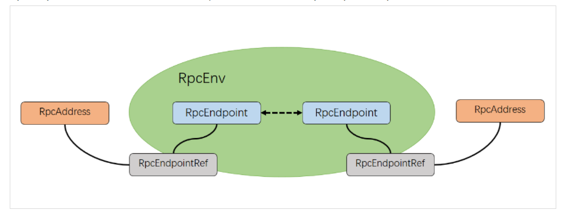
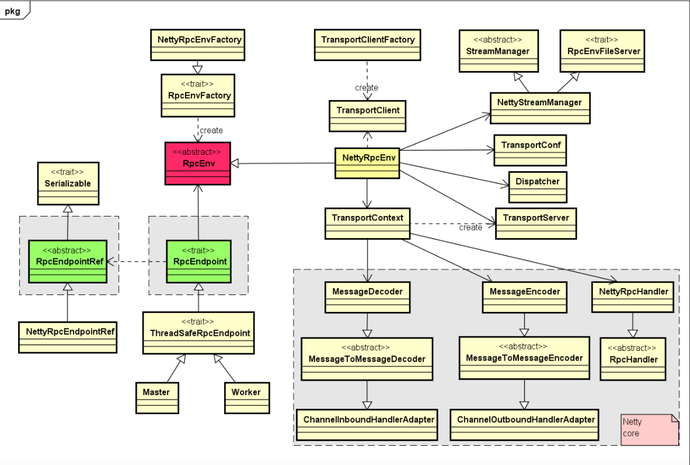

# 一、 总体结构

Spark基于netty的新rpc框架借鉴了Akka中的设计，它是基于Actor模型，各个组件可以认为是一个个独立的实体，各个实体之间通过消息来进行通信。具体各个组件之间的关系如图：



- `RpcEndpoint`

  表示一个个需要通信的个体（如master/worker/driver）。主要根据接收的消息来进行对应的处理。一个`RpcEndpoint`经历的过程依次是：构建->`onStart`->`receive`->`onStop`。

  其中`onStart`在接收任务消息前调用，`receive()`和`receiveAndReply()`分别用来接收另一个`RpcEndpoint`（也可以是本身） `send()`和`ask()`过来的消息。

- `RpcEndpointRef`

  `RpcEndpointRef`是对`RpcEndpoint`的一个引用。当需要向一个具体的`RpcEndpoint`发送消息时，一般需要获取到该`RpcEndpoint`的引用，然后通过该引用发送消息。

- `RpcAddress`

  表示远程的`RpcEndpointRef`的地址，Host+Port

-  `RpcEnv`

  `RpcEnv`为`RpcEndpoint`提供处理消息的环境。`RpcEnv`负责`RpcEndpoint`整个生命周期的管理，包括：注册endpoint，endpoint之间消息的路由，以及停止endpoint。

Rpc实现相关类之间的关系图如下:



核心要点如下：

- 核心的`RpcEnv`是一个特质（trait），它主要提供了停止、注册、获取endpoint等方法的定义，而`NettyRpcEnv`提供了该特质的一个具体实现。

- 通过工厂`RpcEnvFactory`来产生一个`RpcEnv`，而`NettyRpcEnvFactory`用来生成`NettyRpcEnv`的一个对象。

- 当调用`RpcEnv`中的`setUpEndpoint`来注册一个endpoint到`RpcEnv`时，在`NettyRpcEnv`内部，回将该endpoint的名称与其本身的映射关系，`rpcEndpoint`与`rpcEndpointRef`之间映射关系保存在dispatcher对应的成员变量中。

# 二、`RpcEnv`

```scala
package org.apache.spark.rpc

/**
 * A RpcEnv implementation must have a [[RpcEnvFactory]] implementation with an empty constructor
 * so that it can be created via Reflection.
 */
private[spark] object RpcEnv {

  def create(
      name: String,
      host: String,
      port: Int,
      conf: SparkConf,
      securityManager: SecurityManager,
      clientMode: Boolean = false): RpcEnv = {
    create(name, host, host, port, conf, securityManager, 0, clientMode)
  }

  def create(
      name: String,
      bindAddress: String,
      advertiseAddress: String,
      port: Int,
      conf: SparkConf,
      securityManager: SecurityManager,
      numUsableCores: Int,
      clientMode: Boolean): RpcEnv = {
    val config = RpcEnvConfig(conf, 
                              name, 
                              bindAddress, 
                              advertiseAddress, 
                              port, 
                              securityManager,
                              umUsableCores, 
                              clientMode)
    new NettyRpcEnvFactory().create(config)
  }
}


/**
 * An RPC environment. [[RpcEndpoint]]s need to register itself with a name to [[RpcEnv]] to
 * receives messages. Then [[RpcEnv]] will process messages sent from [[RpcEndpointRef]] or remote
 * nodes, and deliver them to corresponding [[RpcEndpoint]]s. 
 * For uncaught exceptions caught by [[RpcEnv]], [[RpcEnv]] will use [[RpcCallContext.sendFailure]] 
 * to send exceptions back to the sender, or logging them if no such sender or `NotSerializableException`.
 *
 * [[RpcEnv]] also provides some methods to retrieve [[RpcEndpointRef]]s given name or uri.
 */
private[spark] abstract class RpcEnv(conf: SparkConf) {
    
  private[spark] val defaultLookupTimeout = RpcUtils.lookupRpcTimeout(conf)
  
  private[rpc] def endpointRef(endpoint: RpcEndpoint): RpcEndpointRef
    
  def address: RpcAddress
    
  def setupEndpoint(name: String, endpoint: RpcEndpoint): RpcEndpointRef
    
  def asyncSetupEndpointRefByURI(uri: String): Future[RpcEndpointRef]
    
  def setupEndpointRefByURI(uri: String): RpcEndpointRef = { defaultLookupTimeout.awaitResult(asyncSetupEndpointRefByURI(uri))}
    
  
  def setupEndpointRef(address: RpcAddress, endpointName: String): RpcEndpointRef = {
    setupEndpointRefByURI(RpcEndpointAddress(address, endpointName).toString)
  }
    
  def stop(endpoint: RpcEndpointRef): Unit

  def shutdown(): Unit

  def awaitTermination(): Unit

  def deserialize[T](deserializationAction: () => T): T

  def fileServer: RpcEnvFileServer

  def openChannel(uri: String): ReadableByteChannel

}
```

`RpcEnv`表示RPC环境，只有唯一的子类`NettyRpcEnv`。

## 1. `RpcEndpoint`

`RpcEndpoint`是RPC通信实体的统一抽象，所有运行于RPC框架之上的实体都应该继承`RpcEndpoint`。`receive()`方法用于处理`RpcEndpointRef.send()` 和 `RpcCallContext.reply()`发送的消息，`receiveAndReply()`则是用于`RpcEndpointRef.ask()`发送的消息。其他主要是提供了一些待实现的回调函数。

```scala
/**
 * An end point for the RPC that defines what functions to trigger given a message.
 *
 * It is guaranteed that `onStart`, `receive` and `onStop` will be called in sequence.
 *
 * The life-cycle of an endpoint is: {@code constructor -> onStart -> receive* -> onStop}
 *
 * Note: `receive` can be called concurrently. If you want `receive` to be thread-safe, please use [[ThreadSafeRpcEndpoint]]
 *
 * If any error is thrown from one of [[RpcEndpoint]] methods except `onError`, `onError` will be
 * invoked with the cause. If `onError` throws an error, [[RpcEnv]] will ignore it.
 */
private[spark] trait RpcEndpoint {
    
  // 当前RpcEndpoint所属的RpcEnv
  val rpcEnv: RpcEnv

  // 获取RpcEndpoint相关联的RpcEndpointRef。
  final def self: RpcEndpointRef = {
    require(rpcEnv != null, "rpcEnv has not been initialized")
    rpcEnv.endpointRef(this)
  }
  
  // 接收消息并处理，不需要给客户端回复
  def receive: PartialFunction[Any, Unit] = {
    case _ => throw new SparkException(self + " does not implement 'receive'")
  }
  
  // 接收消息并处理，需要给客户端回复
  def receiveAndReply(context: RpcCallContext): PartialFunction[Any, Unit] = {
    case _ => context.sendFailure(new SparkException(self + " won't reply anything"))
  }
    
  //处理消息发生异常时调用
  def onError(cause: Throwable): Unit = { throw cause }
    
  def onConnected(remoteAddress: RpcAddress): Unit = {}
    
  def onDisconnected(remoteAddress: RpcAddress): Unit = {}
    
  def onNetworkError(cause: Throwable, remoteAddress: RpcAddress): Unit = {}
    
  def onStart(): Unit = {}

  def onStop(): Unit = {}

  final def stop(): Unit = {
    val _self = self
    if (_self != null) { rpcEnv.stop(_self) }
  }
    
}
```

`RpcEndpoint`一般通过匿名内部类和已经实现好的子类来使用。`ThreadSafeRpcEndpoint`是继承自`RpcEndpoint`的特质，主要用于对消息的处理必须是线程安全的场景。`ThreadSafeRpcEndpoint`对消息的处理都是串行的，即前一条消息处理完才能接着处理下一条消息。

```scala
// A trait that requires RpcEnv thread-safely sending messages to it.
private[spark] trait ThreadSafeRpcEndpoint extends RpcEndpoint

// An endpoint that uses a dedicated thread pool for delivering messages.
private[spark] trait IsolatedRpcEndpoint extends RpcEndpoint
```

## 2. `RpcEndpointRef`

远端`RpcEndpoint`引用，用于消息发送方持有并向远端的`RpcEndpoint`发送消息。

一般而言，消息投递规则有三种：

- at-most-once

  一条消息最多投递一次，可以允许丢失。

- at-least-once

  一条消息可多次尝试投递，至少成功一次，可以允许重复。

- exactly-once

  一条消息精准投递一次。


```scala
package org.apache.spark.rpc

/**
 * A reference for a remote [[RpcEndpoint]]. [[RpcEndpointRef]] is thread-safe.
 */
private[spark] abstract class RpcEndpointRef(conf: SparkConf) extends Serializable with Logging {
  
  // 最大尝试连接次数。可以通过`spark.rpc.numRetries`参数指定，默认为3
  private[this] val maxRetries = RpcUtils.numRetries(conf)
    
  // 每次尝试连接最大等待毫秒值。可以通过`spark.rpc.retry.wait`，默认3s
  private[this] val retryWaitMs = RpcUtils.retryWaitMs(conf)
    
  // RPC ask操作的超时时间。受`spark.rpc.askTimeout`/`spark.network.timeout`控制，默认120s
  private[this] val defaultAskTimeout = RpcUtils.askRpcTimeout(conf)
    
  // 返回当前RpcEndpointRef对应RpcEndpoint的RPC地址
  def address: RpcAddress
  
  // 返回当前RpcEndpointRef对应RpcEndpoint的名称
  def name: String
    
  // 发送单向异步的消息。发完即忘语义,at-most-once规则
  def send(message: Any): Unit
    
  def askAbortable[T: ClassTag](message: Any, timeout: RpcTimeout): AbortableRpcFuture[T] = {
    	throw new UnsupportedOperationException()
  }
    
  // 发送消息到相应的`RpcEndpoint.receiveAndReply()` , 并返回 `Future`，以在默认超时或者自定义超时内接收返回值
  def ask[T: ClassTag](message: Any, timeout: RpcTimeout): Future[T]
  def ask[T: ClassTag](message: Any): Future[T] = ask(message, defaultAskTimeout)

  // 与`ask()`类似，不过直接返回接收消息并且是阻塞的方法
  def askSync[T: ClassTag](message: Any): T = askSync(message, defaultAskTimeout)
  def askSync[T: ClassTag](message: Any, timeout: RpcTimeout): T = {
    	val future = ask[T](message, timeout)
    	timeout.awaitResult(future)
  }
    
}
```

`RpcEndpointRef` 存在唯一实现类 `NettyRpcEndpointRef`，重写的`ask()`和`send()`，首先将message封装为`RequestMessage`然后再调用`NettyRpcEnv`的`ask()`和`send()`方法。

# 二、`NettyRpcEnv`

`NettyRpcEnv`是`RpcEnv`的唯一实现，创建`NettyRpcEnv`一般通过`NettyRpcEnvFactory`。在`SparkEnv`中，创建`RpcEnv`即默认创建`NettyRpcEnv`：

```scala
systemName = if (isDriver) driverSystemName else executorSystemName
val rpcEnv = RpcEnv.create(systemName, bindAddress, advertiseAddress, port.getOrElse(-1), conf,
                           securityManager, numUsableCores, !isDriver)

// RpcEnv.create()方法是：
def create(
    name: String,
    bindAddress: String,
    advertiseAddress: String,
    port: Int,
    conf: SparkConf,
    securityManager: SecurityManager,
    numUsableCores: Int,
    clientMode: Boolean): RpcEnv = {
    val config = RpcEnvConfig(conf, name, bindAddress, advertiseAddress, port, securityManager,
                              numUsableCores, clientMode)
    new NettyRpcEnvFactory().create(config)
}
```

`NettyRpcEnvFactory`的`create()`方法就是新建`NettyRpcEnv`实例并调用该实例的`startServer()`方法并启动：

```scala
private[rpc] class NettyRpcEnvFactory extends RpcEnvFactory with Logging {

  def create(config: RpcEnvConfig): RpcEnv = {
    val sparkConf = config.conf
    val javaSerializerInstance = new JavaSerializer(sparkConf).newInstance().asInstanceOf[JavaSerializerInstance]
    // 新建NettyRpcEnv实例
    val nettyEnv = new NettyRpcEnv(sparkConf, 
                                   javaSerializerInstance, 
                                   config.advertiseAddress,
                                   config.securityManager, 
                                   config.numUsableCores)
    if (!config.clientMode) {
      val startNettyRpcEnv: Int => (NettyRpcEnv, Int) = { 
          actualPort =>
            nettyEnv.startServer(config.bindAddress, actualPort)
            (nettyEnv, nettyEnv.address.port)
      }
      try {
        Utils.startServiceOnPort(config.port, startNettyRpcEnv, sparkConf, config.name)._1
      } catch {
        case NonFatal(e) =>
          nettyEnv.shutdown()
          throw e
      }
    }
    nettyEnv
  }
}
```

`NettyRpcEnv`代码如下：

```scala
package org.apache.spark.rpc.netty

private[netty] object NettyRpcEnv extends Logging {

    private[netty] val currentEnv = new DynamicVariable[NettyRpcEnv](null)

    private[netty] val currentClient = new DynamicVariable[TransportClient](null)
}

private[netty] class NettyRpcEnv(
    val conf: SparkConf,
    javaSerializerInstance: JavaSerializerInstance,
    host: String,
    securityManager: SecurityManager,
    numUsableCores: Int) extends RpcEnv(conf) with Logging {

    // "spark.executor.id"
    val role = conf.get(EXECUTOR_ID).map { id => if (id == SparkContext.DRIVER_IDENTIFIER) "driver" else "executor" }

	// 创建TransportConf
    private[netty] val transportConf = SparkTransportConf.fromSparkConf(
        conf.clone.set(RPC_IO_NUM_CONNECTIONS_PER_PEER, 1),
        "rpc",
        conf.get(RPC_IO_THREADS).getOrElse(numUsableCores),
        role)
	
    // 创建消息调度器Dispatcher
  	private val dispatcher: Dispatcher = new Dispatcher(this, numUsableCores)
    
  	private val streamManager = new NettyStreamManager(this)
	// 创建传输上下文
  	private val transportContext = new TransportContext(transportConf, new NettyRpcHandler(dispatcher, this, streamManager))
    
    // 创建传输客户端工厂TransportClientFactory
    private def createClientBootstraps(): java.util.List[TransportClientBootstrap] = {
        if (securityManager.isAuthenticationEnabled()) {
            java.util.Arrays.asList(new AuthClientBootstrap(transportConf,
                                                            securityManager.getSaslUser(), 
                                                            securityManager))
        } else {
            java.util.Collections.emptyList[TransportClientBootstrap]
        }
    }
  	private val clientFactory = transportContext.createClientFactory(createClientBootstraps())
    
    @volatile private var fileDownloadFactory: TransportClientFactory = _
    
    val timeoutScheduler = ThreadUtils.newDaemonSingleThreadScheduledExecutor("netty-rpc-env-timeout")

    private[netty] val clientConnectionExecutor = ThreadUtils.newDaemonCachedThreadPool(
        "netty-rpc-connection",
        conf.get(RPC_CONNECT_THREADS))

    @volatile private var server: TransportServer = _

    private val stopped = new AtomicBoolean(false)

    private val outboxes = new ConcurrentHashMap[RpcAddress, Outbox]()
    
    // NettyRpcEnvFactory.create()方法会在创建NettyRpcEnv时调用startServer方法
    def startServer(bindAddress: String, port: Int): Unit = {
        val bootstraps: java.util.List[TransportServerBootstrap] =
            if (securityManager.isAuthenticationEnabled()) {
                java.util.Arrays.asList(new AuthServerBootstrap(transportConf, securityManager))
            } else {
                java.util.Collections.emptyList()
            }
        // 创建TransportServer
        server = transportContext.createServer(bindAddress, port, bootstraps)
        dispatcher.registerRpcEndpoint(RpcEndpointVerifier.NAME, new RpcEndpointVerifier(this, dispatcher))
    }

    @Nullable
    override lazy val address: RpcAddress = { if (server != null) RpcAddress(host, server.getPort()) else null}

    override def fileServer: RpcEnvFileServer = streamManager
    
}
```

