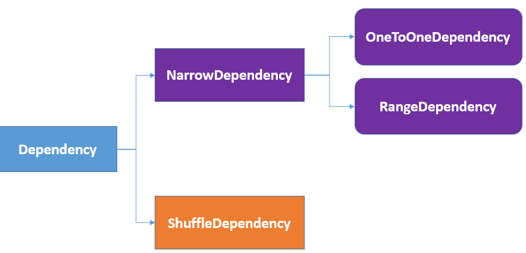

> RDD(Resilient Distributed Datasets，弹性分布式数据集)，是Spark中最基本的数据抽象，代表可并行操作元素的不可变分区集合。RDD的设计思想可参考论文：http://people.csail.mit.edu/matei/papers/2012/nsdi_spark.pdf。RDD解决了MapReduce的缺陷：在并行计算阶段高效地进行数据共享。


RDD类是`org.apache.spark.rdd.RDD`：

```scala
package org.apache.spark.rdd

/**
 * A Resilient Distributed Dataset (RDD), the basic abstraction in Spark. Represents an immutable,
 * partitioned collection of elements that can be operated on in parallel. 
 */
abstract class RDD[T: ClassTag](
    @transient private var _sc: SparkContext,
    // 存储当前RDD的依赖
    @transient private var deps: Seq[Dependency[_]]) extends Serializable with Logging {
  
  // 默认是OneToOneDependency
  def this(@transient oneParent: RDD[_]) = this(oneParent.context, List(new OneToOneDependency(oneParent)))
  
  @DeveloperApi
  def compute(split: Partition, context: TaskContext): Iterator[T]
  
 	// 分区计算器
  @transient val partitioner: Option[Partitioner] = None
  
  /** A friendly name for this RDD */
  @transient var name: String = _
  
  // 与deps相同，但是可以被序列化
  @volatile private var dependencies_ : Seq[Dependency[_]] = _
  @volatile @transient private var legacyDependencies: WeakReference[Seq[Dependency[_]]] = _
  
  // 存储当前RDD所有的分区
  @volatile @transient private var partitions_ : Array[Partition] = _
  
  // 存储级别
  private var storageLevel: StorageLevel = StorageLevel.NONE
  @transient private var resourceProfile: Option[ResourceProfile] = None

  /** User code that created this RDD (e.g. `textFile`, `parallelize`). */
  @transient private[spark] val creationSite = sc.getCallSite()
	
  // 操作作用域
  @transient private[spark] val scope: Option[RDDOperationScope] = {
    Option(sc.getLocalProperty(SparkContext.RDD_SCOPE_KEY)).map(RDDOperationScope.fromJson)
  }
  
  private[spark] var checkpointData: Option[RDDCheckpointData[T]] = None

  def map[U: ClassTag](f: T => U): RDD[U] = withScope {
    val cleanF = sc.clean(f)
    new MapPartitionsRDD[U, T](this, (_, _, iter) => iter.map(cleanF))
  }
  
  def flatMap[U: ClassTag](f: T => TraversableOnce[U]): RDD[U] = withScope {
    val cleanF = sc.clean(f)
    new MapPartitionsRDD[U, T](this, (_, _, iter) => iter.flatMap(cleanF))
  }
  
  def filter(f: T => Boolean): RDD[T] = withScope {
    val cleanF = sc.clean(f)
    new MapPartitionsRDD[T, T](
      this,
      (_, _, iter) => iter.filter(cleanF),
      preservesPartitioning = true)
  }
  
  ... 
}
  

/**
 * Defines implicit functions that provide extra functionalities on RDDs of specific types.
 */
object RDD {

  private[spark] val CHECKPOINT_ALL_MARKED_ANCESTORS = "spark.checkpoint.checkpointAllMarkedAncestors"

  implicit def rddToPairRDDFunctions[K, V](rdd: RDD[(K, V)])
    (implicit kt: ClassTag[K], vt: ClassTag[V], ord: Ordering[K] = null): PairRDDFunctions[K, V] = {
    new PairRDDFunctions(rdd)
  }

  implicit def rddToAsyncRDDActions[T: ClassTag](rdd: RDD[T]): AsyncRDDActions[T] = {
    new AsyncRDDActions(rdd)
  }

  implicit def rddToSequenceFileRDDFunctions[K, V](rdd: RDD[(K, V)])
      (implicit kt: ClassTag[K], vt: ClassTag[V],
                keyWritableFactory: WritableFactory[K],
                valueWritableFactory: WritableFactory[V])
    : SequenceFileRDDFunctions[K, V] = {
    implicit val keyConverter = keyWritableFactory.convert
    implicit val valueConverter = valueWritableFactory.convert
    new SequenceFileRDDFunctions(rdd,
      keyWritableFactory.writableClass(kt), valueWritableFactory.writableClass(vt))
  }

  implicit def rddToOrderedRDDFunctions[K : Ordering : ClassTag, V: ClassTag](rdd: RDD[(K, V)])
    : OrderedRDDFunctions[K, V, (K, V)] = {
    new OrderedRDDFunctions[K, V, (K, V)](rdd)
  }

  implicit def doubleRDDToDoubleRDDFunctions(rdd: RDD[Double]): DoubleRDDFunctions = {
    new DoubleRDDFunctions(rdd)
  }

  implicit def numericRDDToDoubleRDDFunctions[T](rdd: RDD[T])(implicit num: Numeric[T])
    : DoubleRDDFunctions = {
    new DoubleRDDFunctions(rdd.map(x => num.toDouble(x)))
  }
}
```

所有的RDD都支持一些基础操作，如`map`/`flatMap`/`filter`/`persist`。额外的，

- `org.apache.spark.rdd.PairRDDFunctions`支持一些kv对的RDD操作，如`groupByKey`/`join`。
- `org.apache.spark.rdd.DoubleRDDFunctions`支持一些`Double`的RDD操作
- `org.apache.spark.rdd.SequenceFileRDDFunctions`支持一些可以保存为`SequenceFile`的RDD的操作。


RDD由5个主要属性：

- A list of partitions

  一组数据分区的list。对于RDD来说，每个partition都会被一个计算任务处理，会决定并行计算的粒度。用户可以在创建RDD时指定RDD的分片个数，如果没有指定，那么就会采用默认值（程序所分配到的CPU Core的数目）。

- A function for computing each split

  计算每个分区的函数。

- A list of dependencies on other RDDs

  依赖关系。

- Optionally, a Partitioner for key-value RDDs

  当前Spark中实现了两种类型的分片函数，一个是基于哈希的`HashPartitioner`，另外一个是基于范围的`RangePartitioner`。只有对于key-value的RDD，才会有Partitioner，非key-value的RDD的Parititioner是None。Partitioner函数不但决定了RDD本身的分片数量，也决定了parent RDD Shuffle输出时的分片数量。

- Optionally, a list of preferred locations to compute each split on

  储存取每个Partition的优先位置（preferred location）的list。对于一个HDFS文件来说，这个列表保存的就是每个Partition所在的块的位置。按照“移动数据不如移动计算”的理念，Spark在进行任务调度的时候，会尽可能地将计算任务分配到其所要处理数据块的存储位置。

RDD可以由以下几种方式得来：

- 稳定的存储创建
- 通过并行化方式创建
- 由其他RDD转化而来


# 一、 `org.apache.spark.Partition`

RDD中的`partitions_`存储分区信息，每个RDD包括多个分区, 这既是RDD的数据单位, 也是计算粒度：

```scala
// 存储当前RDD所有的分区
@volatile @transient private var partitions_ : Array[Partition] = _
```

`org.apache.spark.Partition`是一个特质：

```scala
package org.apache.spark

// An identifier for a partition in an RDD.
trait Partition extends Serializable {
  // Get the partition's index within its parent RDD
  def index: Int

  // A better default implementation of HashCode
  override def hashCode(): Int = index

  override def equals(other: Any): Boolean = super.equals(other)
}
```

RDD中的`iterator()`方法用来获取`split`指定的partition index对应数据的迭代器，有了这个迭代器就能一条一条取出数据来按 compute chain 来执行一个个transform 操作。

```scala
final def iterator(split: Partition, context: TaskContext): Iterator[T] = {
  if (storageLevel != StorageLevel.NONE) {
    getOrCompute(split, context)
  } else {
    computeOrReadCheckpoint(split, context)
  }
}
```

子类可以通过调用`org.apache.spark.rdd.RDD#partitions`方法来获取分区列表，当处于检查点时，分区信息会被重写。

# 二、 `org.apache.spark.Partitioner`

RDD的`partitioner`存储partitioner函数(分片函数)，分区函数用来将数据分配到指定分区。目前实现有`HashPartitioner`和`RangePartitioner`, 只有key-value的RDD才会有分片函数, 其余RDD的分片函数为`None`。分片函数不仅决定了当前分片的个数, 同时决定parent shuffle RDD的输出的分区个数。

```scala
/** Optionally overridden by subclasses to specify how they are partitioned. */
@transient val partitioner: Option[Partitioner] = None
```

# 三、 `org.apache.spark.Dependency`

RDD的`deps`和`dependencies_`存储RDD的依赖关系，依赖关系指RDD由哪(几)个RDD生成。明确了依赖关系，可以有助于阶段和任务的划分； 也有助于在某个分区出错的时候，允许只重新计算与当前出错的分区有关的分区，而非所有的分区。

```scala
abstract class RDD[T: ClassTag](
    @transient private var _sc: SparkContext,
    @transient private var deps: Seq[Dependency[_]]
  ) extends Serializable with Logging {
	
  @volatile private var dependencies_ : Seq[Dependency[_]] = _
  
  ...
}
```




RDD的依赖关系有两种：窄依赖(narrow dependency)和宽依赖(wide dependency)。窄依赖是指一个父RDD的partition最多被一个子RDD的一个partition使用；宽依赖指多个子RDD的partition会依赖同一个父RDD的partition。所有依赖都是继承`org.apache.spark.Dependency[T]`抽象类，源码如下：

```scala
@DeveloperApi
abstract class Dependency[T] extends Serializable {
  def rdd: RDD[T]
}

@DeveloperApi
abstract class NarrowDependency[T](_rdd: RDD[T]) extends Dependency[T] {
  
  def getParents(partitionId: Int): Seq[Int]
  override def rdd: RDD[T] = _rdd
}

@DeveloperApi
class OneToOneDependency[T](rdd: RDD[T]) extends NarrowDependency[T](rdd) {
  override def getParents(partitionId: Int): List[Int] = List(partitionId)
}

@DeveloperApi
class RangeDependency[T](rdd: RDD[T], inStart: Int, outStart: Int, length: Int)
      extends NarrowDependency[T](rdd) {

  override def getParents(partitionId: Int): List[Int] = {
    if (partitionId >= outStart && partitionId < outStart + length) {
      List(partitionId - outStart + inStart)
    } else {
      Nil
    }
  }
}

@DeveloperApi
class ShuffleDependency[K: ClassTag, V: ClassTag, C: ClassTag](
    @transient private val _rdd: RDD[_ <: Product2[K, V]],
    val partitioner: Partitioner,
    val serializer: Serializer = SparkEnv.get.serializer,
    val keyOrdering: Option[Ordering[K]] = None,
    val aggregator: Option[Aggregator[K, V, C]] = None,
    val mapSideCombine: Boolean = false,
    val shuffleWriterProcessor: ShuffleWriteProcessor = new ShuffleWriteProcessor)
  extends Dependency[Product2[K, V]] {

  if (mapSideCombine) {
    require(aggregator.isDefined, "Map-side combine without Aggregator specified!")
  }
    
  override def rdd: RDD[Product2[K, V]] = _rdd.asInstanceOf[RDD[Product2[K, V]]]

  private[spark] val keyClassName: String = reflect.classTag[K].runtimeClass.getName
  private[spark] val valueClassName: String = reflect.classTag[V].runtimeClass.getName
  private[spark] val combinerClassName: Option[String] = Option(reflect.classTag[C]).map(_.runtimeClass.getName)

  val shuffleId: Int = _rdd.context.newShuffleId()

  val shuffleHandle: ShuffleHandle = _rdd.context.env.shuffleManager.registerShuffle(shuffleId, this)

  private[spark] var mergerLocs: Seq[BlockManagerId] = Nil

  def setMergerLocs(mergerLocs: Seq[BlockManagerId]): Unit = {
    if (mergerLocs != null) {
      this.mergerLocs = mergerLocs
    }
  }

  def getMergerLocs: Seq[BlockManagerId] = mergerLocs

  _rdd.sparkContext.cleaner.foreach(_.registerShuffleForCleanup(this))
  _rdd.sparkContext.shuffleDriverComponents.registerShuffle(shuffleId)
}
```

# 四、 `org.apache.spark.rdd.RDD#compute`

当调用`org.apache.spark.rdd.RDD#iterator`方法无法从缓存或checkpoint获取指定partition的迭代器时，会最终调用`compute()`方法来获取：

```scala
final def iterator(split: Partition, context: TaskContext): Iterator[T] = {
  if (storageLevel != StorageLevel.NONE) {
    getOrCompute(split, context)
  } else {
    // 没有缓存时
    computeOrReadCheckpoint(split, context)
  }
}

private[spark] def computeOrReadCheckpoint(split: Partition, context: TaskContext): Iterator[T] = {
  if (isCheckpointedAndMaterialized) {
    firstParent[T].iterator(split, context)
  } else {
    // 获取RDD指定分区的迭代器
    compute(split, context)
  }
}
```

# 五、 实现举例

## 1. `org.apache.spark.rdd.HadoopRDD`

`org.apache.spark.SparkContext#hadoopFile`方法从Hadoop文件读入数据，返回一个`org.apache.spark.rdd.HadoopRDD`:

```scala
def hadoopFile[K, V](
    path: String,
    inputFormatClass: Class[_ <: InputFormat[K, V]],
    keyClass: Class[K],
    valueClass: Class[V],
    minPartitions: Int = defaultMinPartitions): RDD[(K, V)] = withScope {
 	...

  // A Hadoop configuration can be about 10 KiB, which is pretty big, so broadcast it.
  val confBroadcast = broadcast(new SerializableConfiguration(hadoopConfiguration))
  val setInputPathsFunc = (jobConf: JobConf) => FileInputFormat.setInputPaths(jobConf, path)
  
  new HadoopRDD(
    this,
    confBroadcast,
    Some(setInputPathsFunc),
    inputFormatClass,
    keyClass,
    valueClass,
    minPartitions).setName(path)
}
```

`org.apache.spark.rdd.HadoopRDD`表示从Hadoop存储中读入数据(使用旧API)，代码如下：

```scala
@DeveloperApi
class HadoopRDD[K, V](
    sc: SparkContext,
    broadcastedConf: Broadcast[SerializableConfiguration],
    initLocalJobConfFuncOpt: Option[JobConf => Unit],
    inputFormatClass: Class[_ <: InputFormat[K, V]],
    keyClass: Class[K],
    valueClass: Class[V],
    minPartitions: Int) extends RDD[(K, V)](sc, Nil) with Logging {

  if (initLocalJobConfFuncOpt.isDefined) {
    sparkContext.clean(initLocalJobConfFuncOpt.get)
  }

  def this(sc: SparkContext,
           conf: JobConf,
           inputFormatClass: Class[_ <: InputFormat[K, V]],
           keyClass: Class[K],
           valueClass: Class[V],
           minPartitions: Int) = {
    this(sc,
         sc.broadcast(new SerializableConfiguration(conf)).asInstanceOf[Broadcast[SerializableConfiguration]],
         initLocalJobConfFuncOpt = None,
         inputFormatClass,
         keyClass,
         valueClass,
         minPartitions)
  }
	
  // 计算逻辑，返回的是一个迭代器
  override def compute(theSplit: Partition, context: TaskContext): InterruptibleIterator[(K, V)] = {
    // 新建一个迭代器
    val iter = new NextIterator[(K, V)] {

      private val split = theSplit.asInstanceOf[HadoopPartition]
      
      private val jobConf = getJobConf()

     	...

      private var reader: RecordReader[K, V] = null
      private val inputFormat = getInputFormat(jobConf)
      HadoopRDD.addLocalConfiguration(
        new SimpleDateFormat("yyyyMMddHHmmss", Locale.US).format(createTime),
        context.stageId, theSplit.index, context.attemptNumber, jobConf)

      reader =
        try {
          inputFormat.getRecordReader(split.inputSplit.value, jobConf, Reporter.NULL)
        } catch {
          case e: FileNotFoundException if ignoreMissingFiles =>
            logWarning(s"Skipped missing file: ${split.inputSplit}", e)
            finished = true
            null
          case e: FileNotFoundException if !ignoreMissingFiles => throw e
          case e: IOException if ignoreCorruptFiles =>
            logWarning(s"Skipped the rest content in the corrupted file: ${split.inputSplit}", e)
            finished = true
            null
        }
      // Register an on-task-completion callback to close the input stream.
      context.addTaskCompletionListener[Unit] { context =>
        updateBytesRead()
        closeIfNeeded()
      }

      private val key: K = if (reader == null) null.asInstanceOf[K] else reader.createKey()
      private val value: V = if (reader == null) null.asInstanceOf[V] else reader.createValue()
			
      // getNext
      override def getNext(): (K, V) = {
        try {
          finished = !reader.next(key, value)
        } catch {
          case e: FileNotFoundException if ignoreMissingFiles =>
            logWarning(s"Skipped missing file: ${split.inputSplit}", e)
            finished = true
          // Throw FileNotFoundException even if `ignoreCorruptFiles` is true
          case e: FileNotFoundException if !ignoreMissingFiles => throw e
          case e: IOException if ignoreCorruptFiles =>
            logWarning(s"Skipped the rest content in the corrupted file: ${split.inputSplit}", e)
            finished = true
        }
        if (!finished) {
          inputMetrics.incRecordsRead(1)
        }
        if (inputMetrics.recordsRead % SparkHadoopUtil.UPDATE_INPUT_METRICS_INTERVAL_RECORDS == 0) {
          updateBytesRead()
        }
        (key, value)
      }

      ...
    }
    // 返回InterruptibleIterator，这是对iter的一层封装
    new InterruptibleIterator[(K, V)](context, iter)
  }
  
  override def checkpoint(): Unit = {
    // Do nothing. Hadoop RDD should not be checkpointed.
  }
  
  ...
}
```

## 2. `org.apache.spark.rdd.MapPartitionsRDD`

`org.apache.spark.rdd.RDD#map`返回基于当前RDD映射得到的新RDD，这是一个`MapPartitionsRDD`类型：

```scala
def map[U: ClassTag](f: T => U): RDD[U] = withScope {
  val cleanF = sc.clean(f)
  new MapPartitionsRDD[U, T](this, (_, _, iter) => iter.map(cleanF))
}
```

`MapPartitionsRDD`构造器如下：

```scala
package org.apache.spark.rdd

private[spark] class MapPartitionsRDD[U: ClassTag, T: ClassTag](
  	// 父RDD
    var prev: RDD[T],
  	// 由父RDD计算本RDD的函数
    f: (TaskContext, Int, Iterator[T]) => Iterator[U],  // (TaskContext, partition index, iterator)
    preservesPartitioning: Boolean = false,
    isFromBarrier: Boolean = false,
    isOrderSensitive: Boolean = false) extends RDD[U](prev) {
    
  // firstParent指本RDD依赖(dependencies: Seq[Dependency[_]])中的第一个.
  override val partitioner = if (preservesPartitioning) firstParent[T].partitioner else None
  
  override def getPartitions: Array[Partition] = firstParent[T].partitions

  override def compute(split: Partition, context: TaskContext): Iterator[U] =
    f(context, split.index, firstParent[T].iterator(split, context))

  override def clearDependencies(): Unit = {
    super.clearDependencies()
    prev = null
  }

  @transient protected lazy override val isBarrier_ : Boolean =
    isFromBarrier || dependencies.exists(_.rdd.isBarrier())

  override protected def getOutputDeterministicLevel = {
    if (isOrderSensitive && prev.outputDeterministicLevel == DeterministicLevel.UNORDERED) {
      DeterministicLevel.INDETERMINATE
    } else {
      super.getOutputDeterministicLevel
    }
  }
    
}
```

`MapPartitionsRDD`的依赖中只有一个父 RDD，而`MapPartitionsRDD`的`partition`与其唯一的父RDD的`partition`是一一对应的，所以其`compute()`方法可以描述为：对父RDD的`partition`中的每一个元素执行传入map函数 (`f(context,split.index,iterator)`)得到自身的`partition`及迭代器。

## 3. 

`org.apache.spark.rdd.PairRDDFunctions#groupByKey`


RDD一些重要的继承类：

```
RDD (org.apache.spark.rdd)
    BaseStateStoreRDD (org.apache.spark.sql.execution.streaming.state)
        ReadStateStoreRDD (org.apache.spark.sql.execution.streaming.state)
        StateStoreRDD (org.apache.spark.sql.execution.streaming.state)
    BlockRDD (org.apache.spark.rdd)
        WriteAheadLogBackedBlockRDD (org.apache.spark.streaming.rdd)
    CartesianRDD (org.apache.spark.rdd)
        UnsafeCartesianRDD (org.apache.spark.sql.execution.joins)
    CheckpointRDD (org.apache.spark.rdd)
        LocalCheckpointRDD (org.apache.spark.rdd)
        ReliableCheckpointRDD (org.apache.spark.rdd)
    CoalescedRDD (org.apache.spark.rdd)
    CoGroupedRDD (org.apache.spark.rdd)
    ContinuousDataSourceRDD (org.apache.spark.sql.execution.streaming.continuous)
    ContinuousWriteRDD (org.apache.spark.sql.execution.streaming.continuous)
    CustomShuffledRDD (org.apache.spark.scheduler)
    CyclicalDependencyRDD in RDDSuite (org.apache.spark.rdd)
    DataSourceRDD (org.apache.spark.sql.execution.datasources.v2)
    EmptyRDD (org.apache.spark.rdd)
    EmptyRDDWithPartitions in CoalesceExec$ (org.apache.spark.sql.execution)
    FatPairRDD (org.apache.spark)
    FatRDD (org.apache.spark)
    FetchFailureHidingRDD (org.apache.spark.executor)
    FetchFailureThrowingRDD (org.apache.spark.executor)
    FileScanRDD (org.apache.spark.sql.execution.datasources)
    HadoopMapPartitionsWithSplitRDD in HadoopRDD$ (org.apache.spark.rdd)
    HadoopRDD (org.apache.spark.rdd)
    JdbcRDD (org.apache.spark.rdd)
    JDBCRDD (org.apache.spark.sql.execution.datasources.jdbc)
    KafkaRDD (org.apache.spark.streaming.kafka010)
    KafkaSourceRDD (org.apache.spark.sql.kafka010)
    LocationPrefRDD (org.apache.spark.rdd)
    MapPartitionsRDD (org.apache.spark.rdd)
    MapWithStateRDD (org.apache.spark.streaming.rdd)
    MockRDD (org.apache.spark.scheduler)
        MockRDDWithLocalityPrefs (org.apache.spark.scheduler)
    MyCoolRDD (org.apache.spark.rdd)
    MyRDD (org.apache.spark.scheduler)
        MyCheckpointRDD (org.apache.spark.scheduler)
    NewHadoopMapPartitionsWithSplitRDD in NewHadoopRDD$ (org.apache.spark.rdd)
    NewHadoopRDD (org.apache.spark.rdd)
        BinaryFileRDD (org.apache.spark.rdd)
        WholeTextFileRDD (org.apache.spark.rdd)
    PairwiseRDD (org.apache.spark.api.python)
    ParallelCollectionRDD (org.apache.spark.rdd)
    PartitionerAwareUnionRDD (org.apache.spark.rdd)
    PartitionPruningRDD (org.apache.spark.rdd)
    PartitionwiseSampledRDD (org.apache.spark.rdd)
    PipedRDD (org.apache.spark.rdd)
    PythonRDD (org.apache.spark.api.python)
    RandomRDD (org.apache.spark.mllib.rdd)
    RandomVectorRDD (org.apache.spark.mllib.rdd)
    ShuffledRDD (org.apache.spark.rdd)
    ShuffledRowRDD (org.apache.spark.sql.execution)
    SlidingRDD (org.apache.spark.mllib.rdd)
    SQLExecutionRDD (org.apache.spark.sql.execution)
    SubtractedRDD (org.apache.spark.rdd)
    UnionRDD (org.apache.spark.rdd)
    VertexRDD (org.apache.spark.graphx)
        VertexRDDImpl (org.apache.spark.graphx.impl)
    ZippedPartitionsBaseRDD (org.apache.spark.rdd)
        ZippedPartitionsRDD2 (org.apache.spark.rdd)
        ZippedPartitionsRDD3 (org.apache.spark.rdd)
        ZippedPartitionsRDD4 (org.apache.spark.rdd)
    ZippedWithIndexRDD (org.apache.spark.rdd)
```


