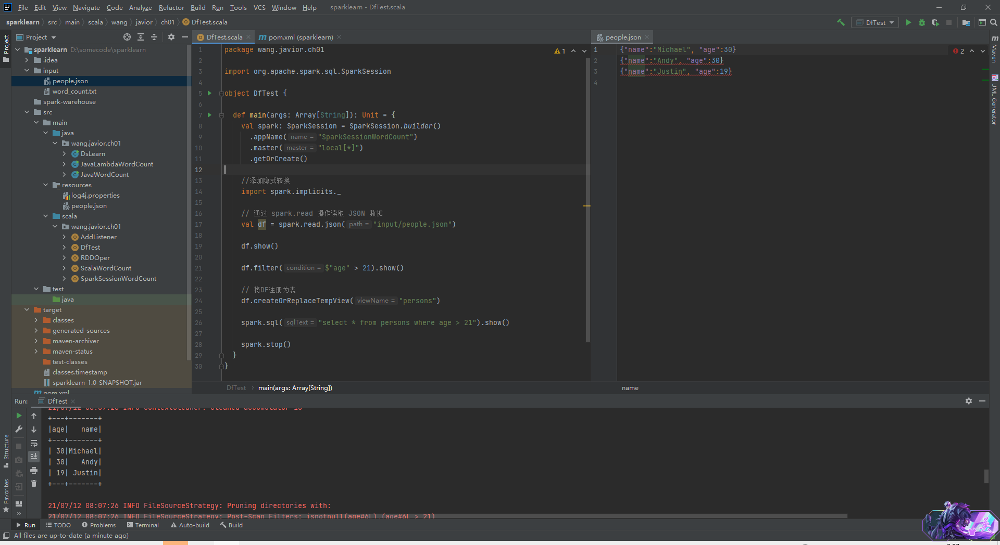

> Spark SQL是一个用于处理结构化数据的Spark组件，自Spark 1.0版本加入后，一直是Spark生态系统中最活跃的组件之一。

# 一、 Spark SQL代码示例

典型的Spark SQL应用场景中，数据的读取、数据表的创建和分析都是必不可少的过程。通常来讲，SQL查询所面对的数据模型以关系表为主。如下是Spark代码示例：

```scala
package com.example
 
import org.apache.spark.rdd.RDD
import org.apache.spark.{SparkConf, SparkContext}
 
object WordCount {
    
  def main(args: Array[String]): Unit = {
    val spark: SparkSession = SparkSession.builder()
      .appName("SparkSessionWordCount")
      .master("local[*]")
      .getOrCreate()

    val lines: Dataset[String] = spark.read.textFile("input/word_count.txt")

    //添加隐式转换
    import spark.implicits._

    //Dataset只有一列，默认列名为value
    val words: Dataset[String] = lines.flatMap(_.split(" "))

    //注册视图
    words.createTempView("word_table")

    //执行sql（lazy）
    val dataFrame: DataFrame = spark.sql("select value, count(*) counts from word_table group by value order by value desc")

    //执行计算
    dataFrame.show()
  }
}
```

结果如下：



代码中的操作可以分为3步：

- 创建`SparkSession`。从2.0开始，`SparkSession`逐步取代`SparkContext`称为Spark应用程序的入口。
- 创建数据表并读取数据。
- 通过SQL进行数据分析。

第二步创建数据表本质上也是SQL的一种，执行过程与第3步类似。

# 二. SQL转换过程

对于Spark SQL，从SQL到Spark的RDD的执行需要经过两大阶段，分别是逻辑计划和物理计划。
