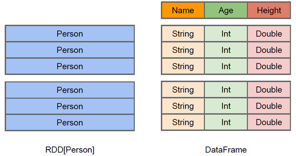
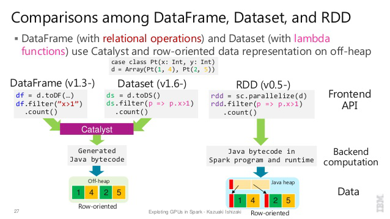
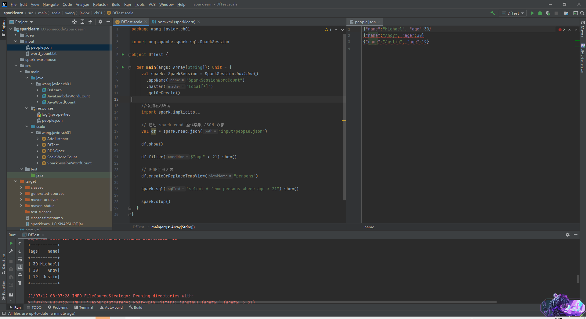

> Spark官方对Spark SQL的定义是：一个用于处理***结构化数据***的Spark组件。自1.0版本加入后，Spark SQL一直是Spark生态系统中最活跃的组件之一。

# 一、 DataFrame和DataSet

> RDD API比传统的MapReduce API在易用性上有了巨大的提升，但还是存在一定的门槛。Spark SQL 1.3版本开始在原有SchemaRDD的基础上提供了与R/Pandas风格类似的DataFrame API，不仅大大降低了学习门槛，还支持Scala、Java、Python、R语言。

Spark在RDD的基础上提供了`DataFrame`和`DataSet`用户编程接口，并在跨语言(Scala/Java/Python/R)方面有很好的支持。从Spark 2.0开始，`DataFrame`和`DataSet`进行了统一，可以理解为`DataFrame = Dataset[Row]`。

RDD是Spark计算的基石，是一个懒执行的不可变的可以支持lambda表达式的并行数据集合。RDD比较简单，但是有性能限制：它是一个 JVM 驻内存对象，这也就决定了存在 GC 的限制和Java序列化的成本。

`DataFrame`和RDD一样，也是不可变分布式弹性数据集。RDD中数据不包含任何结构性信息，而`DataFrame`除数据外还记录数据的结构信息(`schema`)，其中的数据集类似于关系数据库中的表，按列名存储，每一列都带有名称和类型。



上图体现了`DataFrame`和RDD的区别。左侧的`RDD[Person]`虽然以`Person`为类型参数，但 Spark 框架本身不了解`Person`类的内部结构。而右侧的 `DataFrame`却提供了详细的结构信息，使得 Spark SQL 可以清楚地知道该数据集中包含哪些列以及每列的名称和类型。RDD是分布式的`Java对象` 的集合。`DataFrame`是分布式的 `Row对象` 的集合。DataFrame 除了提供了比 RDD 更丰富的算子以外，更重要的特点是提升执行效率、减少数据读取以及执行计划的优化，比如 filter 下推、裁剪等。`DataFrame`性能比RDD性能高，主要有两方面原因：

- **定制化内存管理**：数据以二进制的方式存在于`非堆内存`，节省了大量空间之外，还摆脱了 GC 的限制。
- **优化的执行计划**：查询计划通过Catalyst optimiser进行优化。对于普通开发者而言，查询优化器的意义在于，即便是经验并不丰富的程序员写出的次优的查询，也可以被尽量转换为高效的形式予以执行。`DataFrame`的劣势在于在编译期缺少类型安全检查，有可能会运行时出错。

`DataFrame`中的数据抽象是命名元组(`Row`类型)，可以理解为`type DataFrame = RDD[Row] + schema`。`DataSet`有更强大的API，既有类型安全检查也具有 `DataFrame`的查询优化特性。`DataFrame`与`DataSet`整合之后，`DataSet`具有两个完全不同的API特征：强类型API和弱类型API。强类型一般通过Scala中的Case Class或Java的Class来执行；弱类型即`DataFrame`，本质是一种特殊的`DataSet`（`DataSet[Row]`类型）。`DataSet`支持编解码器，当需要访问非堆上的数据时可以避免反序列化整个对象，提高了效率。`DataFrame`只是知道字段，但是不知道字段的类型，所以在执行这些操作的时候是没办法在编译的时候检查是否类型失败的，比如你可以对一个`String`进行减法操作，在执行的时候才报错，而`DataSet`不仅仅知道字段，而且知道字段类型，所以有更严格的错误检查。


`DataFrame`和`Dataset`实质上都是一个逻辑计划，并且是懒加载的，包含schema信息，只有到数据要读取的时候，才会将逻辑计划进行分析和优化，并最终转化为RDD。



RDD、`DataFrame`、`Dataset`三者有许多共性，有各自适用的场景常常需要在三者之间转换:

- RDD -> `DataFrame` 

   ````scala
   rdd.map(_.split(" ")).map(para => (para(0).trim(), para(1).trim().toInt)).toDF("name", "age")
   ````

- RDD -> `DataSet` 

  ```scala
  case class Person(name:String, age: Int)
  rdd.map(_.split(" ")).map(para => Person(para(0).trim(), para(1).trim().toInt)).toDS
  ```

- `DataFrame` -> RDD 

  `df.rdd`

- `DataSet` -> RDD 

   `ds.rdd`

- `DataFrame` -> `DataSet` 

   `df.as[Person]`

- `DataSet` -> `DataFrame` 

   `ds.toDF`

# 二、 Spark SQL代码示例

典型的Spark SQL应用场景中，数据的读取、数据表的创建和分析都是必不可少的过程。通常来讲，SQL查询所面对的数据模型以关系表为主。如下是代码示例。

Maven依赖：

```
<dependency>
            <groupId>org.apache.spark</groupId>
            <artifactId>spark-sql_${scala.version}</artifactId>
            <version>${spark.version}</version>
            <!-- provided 表示编译期可用，运行期不可用 -->
            <!--<scope>provided</scope>-->
</dependency>
```

主代码：

```scala
package com.example

import org.apache.spark.sql.SparkSession

object DfTest {

  def main(args: Array[String]): Unit = {
    val spark: SparkSession = SparkSession.builder()
      .appName("SparkSessionWordCount")
      .master("local[*]")
      .getOrCreate()

    //添加隐式转换
    import spark.implicits._

    // 通过 spark.read 操作读取 JSON 数据
    val df = spark.read.json("input/people.json")

    df.show()

    df.filter($"age" > 21).show()

    // 将DF注册为表
    df.createOrReplaceTempView("persons")

    spark.sql("select * from persons where age > 21").show()

    spark.stop()
  }
}
```

结果如下：



代码中的操作可以分为3步：

- 创建`SparkSession`。从2.0开始，`SparkSession`逐步取代`SparkContext`成为Spark应用程序的入口。
- 创建数据表并读取数据。
- 通过SQL进行数据分析。

第二步创建数据表本质上也是SQL的一种，执行过程与第3步类似。

# 三、 Spark SQL运行原理

传统关系型数据库中，最基本的SQL查询语句（如`SELECT fieldA, fieldB, fieldC FROM tableA WHERE fieldA > 10`）由`Projection(fieldA, fieldB, fieldC)`、`Data Source(tableA)`、`Filter(fieldA > 10)`三部分组成，分别对应SQL查询过程中的`Result` -> `Data Source` -> `Operation`，但实际执行过程是反过来的，按照`Operation`  -> `Data Source`  -> `Result`的顺序，具体过程如下：

1. 词法和语法解析（Parse）

   对读入的SQL语句进行词法和语法解析，分辨出SQL语句中的关键词、表达式、`Projection`、`Data Source`等，判断SQL语句是否规范，并形成逻辑计划。

2. 绑定（Bind）

   将SQL语句和数据库的数据字典（列、表和视图等）进行绑定，如果相关的`Projection`、`Data Source`等存在的话，表示这个SQL是可执行的。

3. 优化（Optimize）

   一般数据库会提供几个执行计划，这些计划一般都有运行统计数据，数据库会选择一个最优计划。

4. 执行（Execute）

   执行前面的步骤获取最优执行计划，返回从数据库中查询的数据集。

Spark SQL对SQL语句的处理是类似的。Spark SQL由Core、Catalyst、Hive、Hive-Thriftserver四个部分组成：

- Core

  负责处理数据的输入、输出，从不同的数据源获取数据，然后将查询结果输出成Data Frame。

- Catalyst

  负责处理SQL，包括解析、绑定、优化、物理计划等。

- Hive

  负责对Hive数据的处理。

- Hive-Thriftserver

  提供CLI和JDBC/ODBC接口等。

对于Spark SQL，从SQL到Spark的RDD的执行需要经过两大阶段，分别是逻辑计划(Logical Plan)和物理计划(Physical Plan)。


逻辑计划阶段会将用户的SQL语句转换成树型数据结构（逻辑算子树），逻辑算子树经历3个阶段，分别对应未解析的逻辑算子树（仅仅是数据结构，不包含任何数据信息等）、解析后的逻辑算子树（节点中绑定各种信息）和优化后的逻辑算子树（应用各种优化规则对一些低效逻辑计划进行转换）。

物理计划节点将最终的逻辑算子树转换成物理算子树，物理算子树的节点直接生成RDD或RDD的transformation操作（每个物理计划节点都实现了对RDD进行转换的execute方法）。物理计划阶段包含3个阶段：

1. 根据逻辑算子树生成物理算子树的列表`Iterator[PhysicalPlan]`（一对多的关系）；
2. 从列表中按照一定的策略选择最优的物理算子树（即`SparkPlan`）；
3. 最后对选取的物理算子树进行提交前的准备工作，如确保分区操作正确、执行代码生成等。

从SQL语句的解析一直到提交前，整个转化过程都在Driver端进行。

# 
